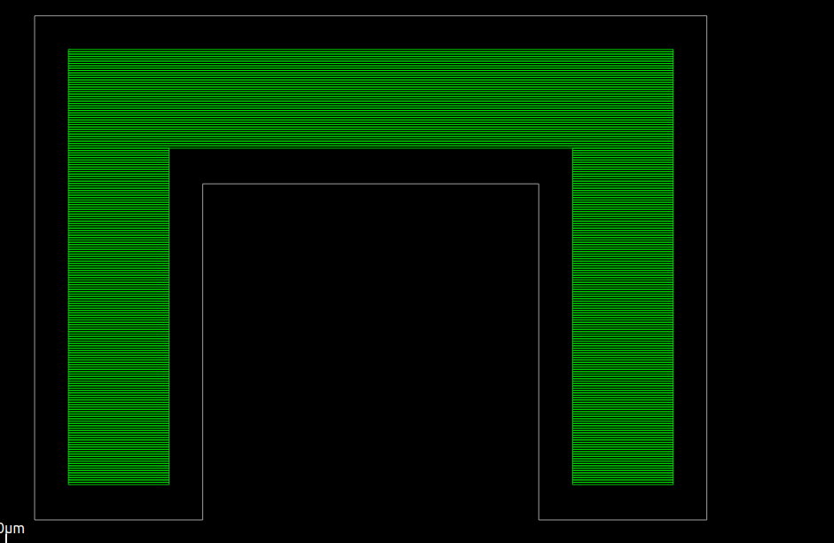
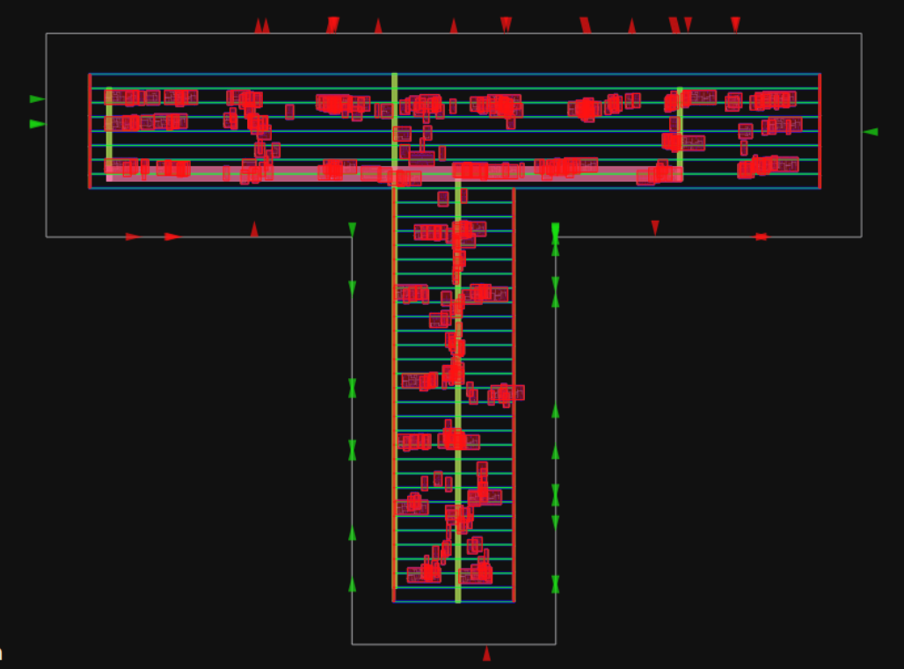

# Final Progress: Enabling Rectilinear Floorplanning in OpenROAD

Hello! I'm excited to share my final progress on implementing **rectilinear (polygonal) die support** in OpenROAD's floorplanning flow as part of Google Summer of Code 2025. Under the guidance of my mentors Eder Monteiro and Augusto Berndt, we've made significant strides in extending OpenROAD to handle non-rectangular die shapes.

Here's a link to my original [proposal](https://summerofcode.withgoogle.com/programs/2025/projects/mcv3Hbgk)

## Project Overview

This project aims to add support for rectilinear floorplans in OpenROAD, an open-source EDA tool used for digital chip design. Currently, OpenROAD only supports rectangular floorplans, which limits its use in modern designs that often require more complex shapes, especially in advanced packaging, chiplet architectures, and 3D ICs.

The project enables users to define floorplans using arbitrary rectilinear shapes made of $90^{\circ}$ corners. It involves three main components:
1.  Accepting polygonal input during floorplan setup
2.  Generating standard cell rows and routing tracks that follow the shape boundaries
3.  Updating pin placement logic to work with irregular outlines

By enabling these capabilities, OpenROAD becomes more flexible and suitable for real-world designs where blocks may need to fit together like puzzle pieces. This can lead to better area utilization and potentially shorter interconnects.

The core challenge is maintaining robustness and backward compatibility while introducing this major new feature that touches multiple aspects of the design flow.

## Pull Requests made

1.  **Support for Rectilinear dies in PPL (Pin Placement)** - [https://github.com/The-OpenROAD-Project/OpenROAD/pull/8182](https://github.com/The-OpenROAD-Project/OpenROAD/pull/8182)
2.  **Support for Rectilinear dies in IFP (Init Floorplan)** - [https://github.com/The-OpenROAD-Project/OpenROAD/pull/7893](https://github.com/The-OpenROAD-Project/OpenROAD/pull/7893)

## Key Contributions

### Phase 1: Init Floorplan (IFP) Module Support

The first half of the project focused on adding support for rectilinear floorplans in the IFP (Init Floorplan) module. This foundational work established the infrastructure for handling non-rectangular die shapes.

#### 1. Polygonal Die Definition
* Implemented support for accepting polygon vertices as input to define rectilinear die shapes.
* Modified the TCL interfaces to accept a list of vertices of the rectilinear die in the `-die_area` and `-core_area` parameters and automatically switch to rectilinear flow.
* Developed validation logic to ensure polygons are rectilinear and valid.

#### 2. Standard Cell Row Generation
* Developed a scanline-based algorithm to generate standard cell rows that conform to complex polygonal boundaries.
* The algorithm sweeps horizontally across the die area and identifies valid row regions within the polygon.
* Routing Track generation logic could directly be used for rectilinear die shapes.

#### 3. Testing and Validation
* Created comprehensive test cases for L-shaped, T-shaped, and other rectilinear configurations for floorplan creation and row generation.
* Ensured backward compatibility with rectangular floorplans.
* Added error handling for edge cases like invalid polygon specifications.

### Demo: U-Shaped Die Row Generation

One of our test cases involved generating rows for a U-shaped die. Here is a snapshot from the OpenROAD GUI displaying perfectly laid out rows:

---

### Phase 2: Pin Placement (PPL) Module Support

#### 1. Core Data Structure Migration
* Leveraged the `odb::Line` class instead of the simple `Edge` enum (which only handled 4 rectangular edges) to store edge data of rectilinear dies. This allows the system to handle an arbitrary number of polygon edges.
* This required refactoring nearly every function in the pin placement pipeline, as the `Edge` enum was deeply embedded throughout the codebase.
* The new representation is more flexible and can handle N-sided polygons while maintaining clean abstractions.

#### 2. Pin Slot Calculation
* Rewrote the `defineSlots()` function family to work with polygon edges while maintaining compatibility with existing die shapes.
* Ensured slots are generated only within valid polygon boundaries.

#### 3. Pin Orientation Algorithm
* One of the most challenging aspects was determining the correct orientation for pins on polygon edges. For rectangular dies, this is trivial, but for complex, concave polygons, it's non-trivial.
* Leveraged the ray tracing algorithm to determine the correct pin orientations. The algorithm casts rays from edge midpoints to determine which side faces the interior of the polygon.
* This ensures pins are correctly oriented and handles complex cases like concave polygons.

#### 4. Hungarian Matching and Simulated Annealing for Polygons
* Successfully extended both Hungarian Matching and Simulated Annealing to work with rectilinear dies as well as regular dies.
* The flow now checks if the provided die is rectilinear and intelligently switches the flow accordingly.

### Demo: T-Shaped Die Pin Placement

The image below shows pins placed on a rectilinear, T-shaped die:

---

## Code Quality

* Followed OpenROAD coding standards and conventions
* Comprehensive error handling and validation
* Extensive code reviews with multiple rounds of refinements
* Well-documented functions and algorithms

## Testing and Validation

* Created multiple test cases covering various rectilinear shapes
* Regression testing to ensure backward compatibility
* Edge case handling (concave polygons, tight geometries, etc.)
* Integration testing with downstream OpenROAD flows

## Future Work

* Supporting constraints for pin placement in PPL - currently in progress
* Improved GUI support for viewing and editing polygonal floorplans
* Further optimizing algorithms for very large polygons

## Acknowledgements

I would like to thank my mentors, Eder Monteiro and Augusto Berndt for their patience, support and guidance throughout the project. Thanks to Stephanie and the entire UC OSPO team as well as Google Summer of Code for providing me with this incredible opportunity.