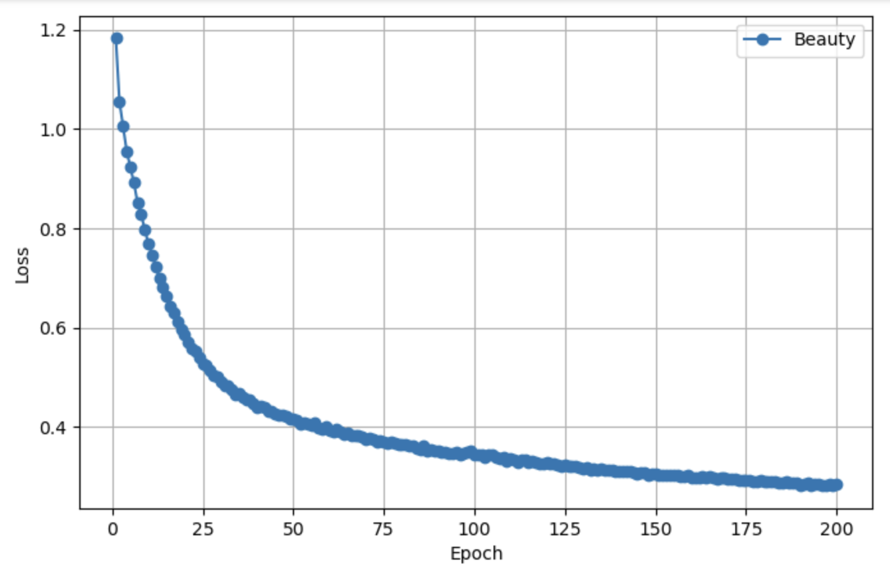
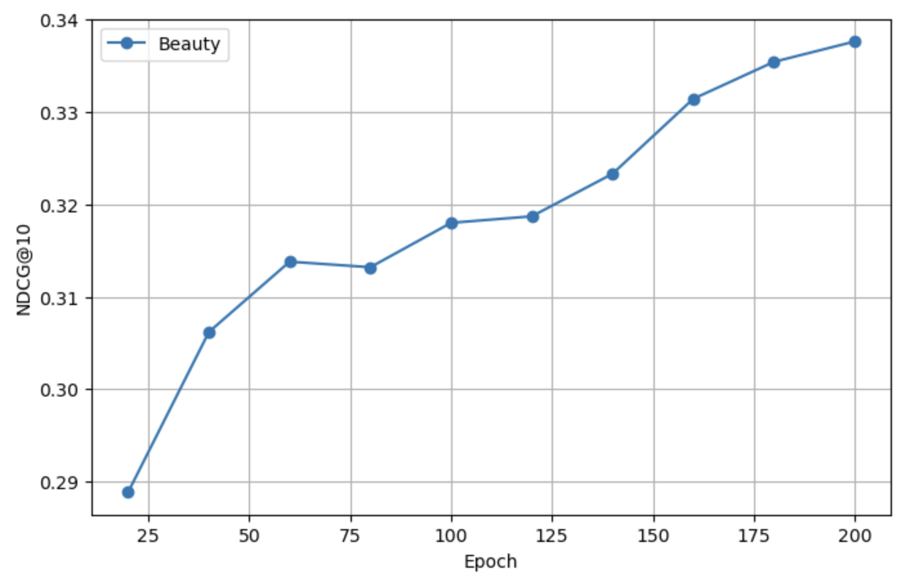
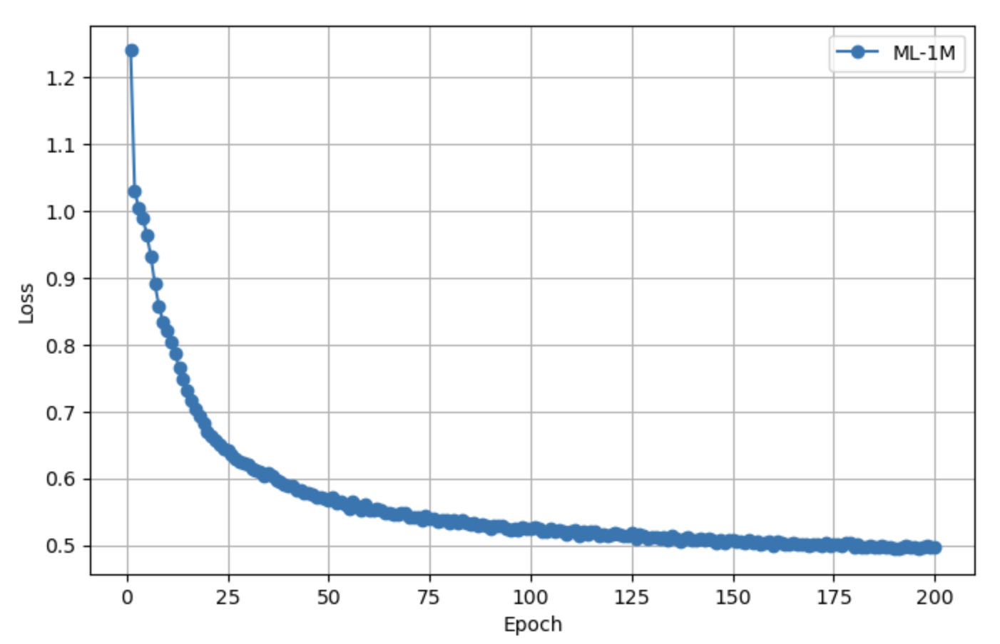
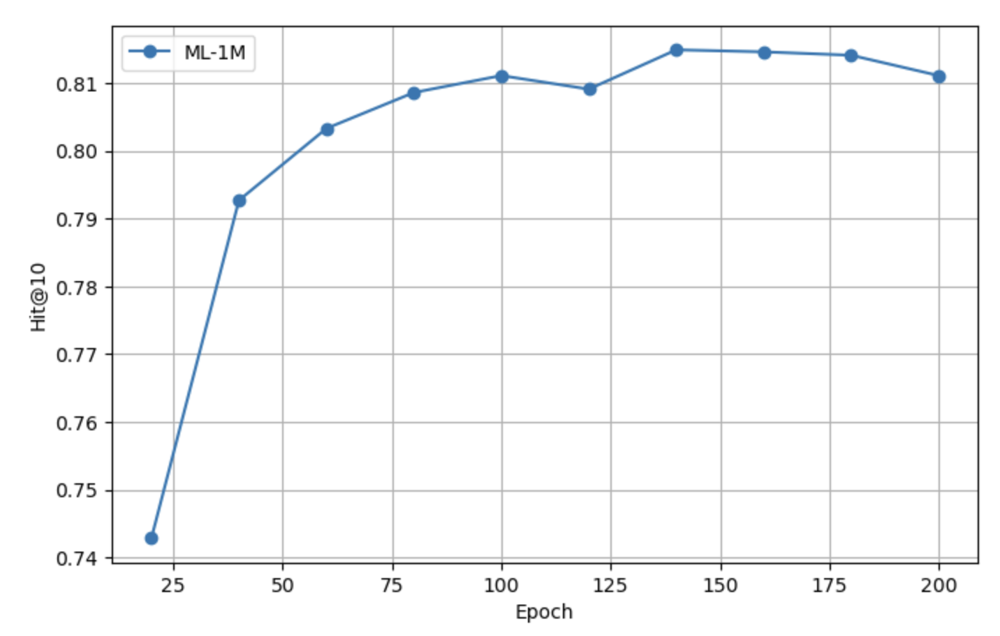
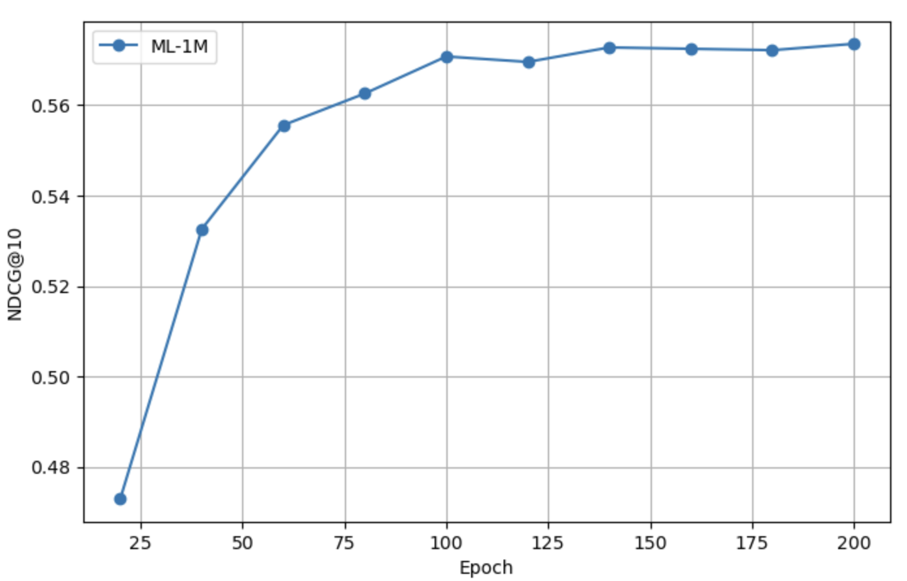

# Midway Through OSRE  
## My Journey with LLMSeqRec

### Hello from the Midpoint!

Hi everyone! I’m Connor Lee, a student at NYU studying Computer Science and Mathematics, and I’m excited to share the progress I’ve made halfway through the Open Source Research Experience (OSRE) with my project: **LLMSeqRec** – a large language model-enhanced sequential recommender system.

Over the past several weeks, I’ve had the opportunity to explore the intersection of recommender systems and large language models (LLMs), and it’s been a deep, challenging, and rewarding dive into building smarter, more contextual recommendation engines.

---

### What is LLMSeqRec?

**LLMSeqRec** stands for **LLM-Enhanced Contextual Sequential Recommender**. Traditional sequential recommendation systems like SASRec are great at capturing patterns from user-item interactions, but they often fall short in two areas: understanding **semantic context** (e.g., item descriptions, reviews) and dealing with **cold-start** problems.

LLMSeqRec aims to address this by incorporating **pretrained LLM embeddings** into the recommendation pipeline. The goal is to enhance models like SASRec with semantic signals from text (like product reviews or titles), allowing them to better model user intent, long-range dependencies, and generalize to new items or users.

---

### Progress So Far

#### ✅ Baseline SASRec Runs

To establish a benchmark, I successfully ran the original SASRec implementation (in PyTorch) using both the **MovieLens 1M** and **Amazon Beauty** datasets. After debugging initial data formatting issues and adjusting batch sizes for local CPU/GPU compatibility, I automated training with scripts that let me scale to **200+ epochs** to acheive the best performance in both Colab and on my MacBook via CPU.

**Note:** At this stage, we have not yet integrated LLMs into the model. These baseline runs (SASRec) serve as the control group for evaluating the future impact of LLM-based enhancements.

---

### What’s Next

As I enter the second half of the OSRE, I’ll be shifting gears toward **LLM integration, model evaluation, and running LLM-powered sequential recommendations using product metadata and contextual information**. Here's what’s ahead:

- Designing pipelines to extract and align textual metadata with item sequences
- Integrating LLM-generated embeddings into the recommender model
- Evaluating performance changes across different dataset characteristics

---

### 📊 Experimental Results

We have **not yet utilized LLMs** in our current experiments. The results below reflect our **reproduced baseline performance of SASRec** across datasets.

Below are the **performance curves on different test sets**, where we evaluate model performance every 20 epochs during training:

#### Beauty Dataset Performance

*Hit@10 performance on the test set for the Beauty dataset (every 20 epochs)*

*Training loss for the Beauty dataset*

*NDCG@10 performance on the test set for the Beauty dataset (every 20 epochs)*

#### ML-1M Dataset Performance

*Training loss for the ML-1M dataset*

*Hit@10 performance on the test set for the ML-1M dataset (every 20 epochs)*

*NDCG@10 performance on the test set for the ML-1M dataset (every 20 epochs)*

These results demonstrate that our **baseline SASRec reproductions** are converging as expected and will serve as a solid foundation for comparison once LLM integration is complete.

---

### Closing Thoughts

This project has been an exciting journey into both research and engineering and I’m excited to explore **LLM-powered embedding integration** in the upcoming phase.

I’m incredibly grateful to my mentors **Dr. Linsey Pang and Dr. Bin Dong** for their support and guidance throughout the project so far. I’m looking forward to sharing more technical results as we work toward building smarter, more adaptable recommender systems.
