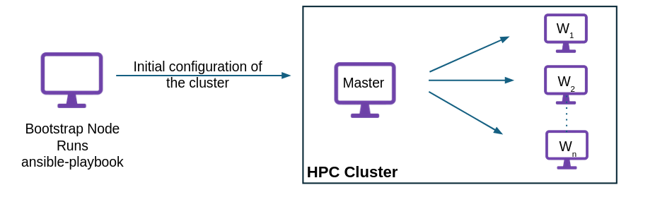

Hi Everyone, This is my final report for the project I completed during my summer as a [Summer of Reproducibility (SOR)](https://ucsc-ospo.github.io/sor/) student. 
The project, titled "[MPI Appliance for HPC Research in Chameleon](https://ucsc-ospo.github.io/project/osre25/uchicago/mpi/)," was undertaken in collaboration with Argonne National Laboratory 
and the Chameleon Cloud community. The project was mentored by {} and was completed over the summer. 
This blog details the work and outcomes of the project.

## Background

Message Passing Interface (MPI) is the backbone of high-performance computing (HPC), enabling efficient scaling across thousands of 
processing cores. However, reproducing MPI-based experiments remains challenging due to dependencies on specific library versions, 
network configurations, and multi-node setups. 

To address this, we introduce a reproducibility initiative that provides standardized MPI environments on the Chameleon testbed. 
This is set up as a master–worker MPI cluster. The master node manages tasks and communication, while the worker nodes do the computations. 
All nodes have the same MPI libraries, software, and network settings, making experiments easier to scale and reproduce.

## Objectives

The aim of this project is to create an MPI cluster that is reproducible, easily deployable, and efficiently configurable.

The key objectives of this project were:

1) Pre-built MPI Images: Create ready-to-use images with MPI and all dependencies installed. 

2) Automated Cluster Configuration: Develop Ansible playbooks to configure master–worker communication, including host setup, SSH key distribution, and MPI configuration across nodes.

3) Cluster Orchestration: Develop orchestration template to provision resources and invoke Ansible playbooks for automated cluster setup.

## Implementation Strategy and Deliverables

### Openstack Image Creation

The first step was to create a standardized pre-built image, which serves as the base image for all nodes in the cluster.

Some important features of the image include:

1) Built on Ubuntu 22.04 for a stable base environment.
2) [Spack](https://spack.io/) + Lmod integration:
   - Spack handles reproducible, version-controlled installations of software packages.
   - Lmod (Lua Modules) provides a user-friendly way to load/unload software environments dynamically.
   - Together, they allow users to easily switch between MPI versions, libraries, and GPU toolkits
3) [MPICH](https://github.com/pmodels/mpich) and [OpenMPI](https://github.com/open-mpi/ompi) pre-installed for standard MPI support and can be loaded/unloaded.
4) Three image variants for various HPC workloads: CPU-only, NVIDIA GPU (CUDA 12.8), and AMD GPU (ROCm 6.4.2).

These images have been published and are available in the Chameleon Cloud Appliance Catalog:

- [MPI and Spack for HPC (Ubuntu 22.04)](https://chameleoncloud.org/appliances/127/) - CPU Only
- [MPI and Spack for HPC (Ubuntu 22.04 - CUDA)](https://chameleoncloud.org/appliances/130/) - NVIDIA GPU (CUDA 12.8)
- [MPI and Spack for HPC (Ubuntu 22.04 - ROCm)](https://chameleoncloud.org/appliances/131/) - AMD GPU (ROCm 6.4.2)

### Cluster Configuration using Ansible

The next step is to create scripts/playbooks to configure these nodes and set up an HPC cluster.
We assigned specific roles to different nodes in the cluster and combined them into a single playbook to configure the entire cluster automatically.

Some key steps the playbook performs:

1) Configure /etc/hosts entries for all nodes.
2) Mount Manila NFS shares on each node.
3) Generate an SSH key pair on the master node and add the master’s public key to the workers’ authorized_keys.
4) Scan worker node keys and update known_hosts on the master.
5) (Optional) Manage software:
   - Install new compilers with Spack
   - Add new Spack packages
   - Update environment modules to recognize them
6) Create a hostfile at /etc/mpi/hostfile.

The code is publicly available and can be found on the GitHub repository: https://github.com/rohanbabbar04/MPI-Spack-Experiment-Artifact

### Orchestration
With the image now created and deployed, and the Ansible scripts ready for cluster configuration, we put everything 
together to orchestrate the cluster deployment.

This can be done in two primary ways:

#### Python CHI(Jupyter) + Ansible

[Python-CHI](https://github.com/ChameleonCloud/python-chi) is a python library designed to facilitate interaction with the Chameleon testbed. Often used within environments like Jupyter notebooks.

This setup can be put up as:

1) Create leases, launch instances, and set up shared storage using python-chi commands.
2) Automatically generate inventory.ini for Ansible based on launched instances.
3) Run Ansible playbook programmatically using `ansible_runner`.
4) Outcome: fully configured, ready-to-use HPC cluster; SSH into master to run examples.

If you would like to see a working example, you can view it in the [Trovi example](https://chameleoncloud.org/experiment/share/7424a8dc-0688-4383-9d67-1e40ff37de17)

#### Heat Orchestration Template

Heat Orchestration Template(HOT) is a YAML based configuration file. Its purpose is to define/create a stack to automate 
the deployment and configuration of OpenStack cloud resources. 

**Challenges**

We faced some challenges while working with Heat templates and stacks in particular in Chameleon Cloud

1) `OS::Nova::Keypair`(new version): In the latest OpenStack version, the stack fails to launch if the ``public_key`` parameter is not provided for the keypair, 
as auto-generation is no longer supported.
2) `OS::Heat::SoftwareConfig`: Deployment scripts often fail, hang, or time out, preventing proper configuration of nodes and causing unreliable deployments.

To tackle these challenges, we designed an approach that is both easy to implement and reproducible. First, we launch instances 
by provisioning master and worker nodes using the HOT template in OpenStack. Next, we set up a bootstrap node, install Git and Ansible, 
and run an Ansible playbook from the bootstrap node to configure the master and worker nodes, including SSH, host communication, and 
MPI setup. The outcome is a fully configured, ready-to-use HPC cluster, where users can simply SSH into the master node to run examples.

Users can view/use the template published in the Appliance Catalog: [MPI+Spack Bare Metal Cluster](https://chameleoncloud.org/appliances/132/).
For example, a demonstration of how to pass parameters is available on [Trovi](https://chameleoncloud.org/experiment/share/7424a8dc-0688-4383-9d67-1e40ff37de17).

## Conclusion

In conclusion, this work demonstrates a reproducible approach to building and configuring MPI clusters on the Chameleon testbed. By using standardized images, 
Ansible automation, and Orchestration Templates, we ensure that every node is consistently set up, reducing manual effort and errors. The artifact, published on Trovi, 
makes the entire process transparent, reusable, and easy to implement, enabling users/researchers to reliably recreate and extend the cluster environment for their own 
experiments.

## Future Work

Maintaining these images and possibly creating a script to reproduce MPI and Spack on a different image base environment.
