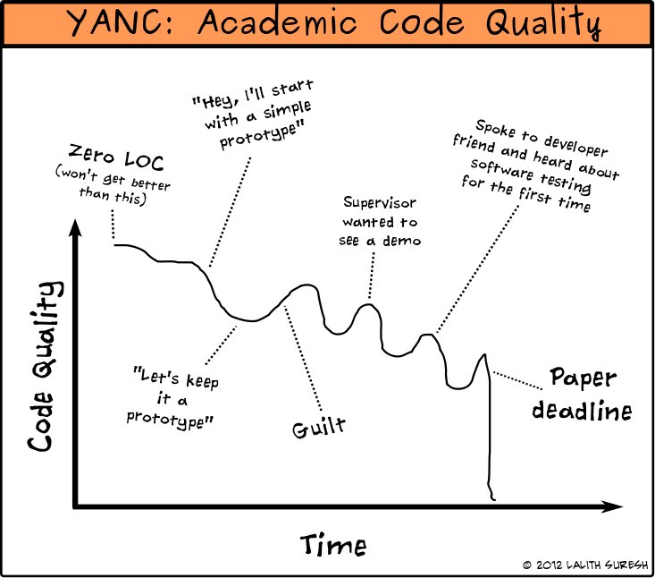
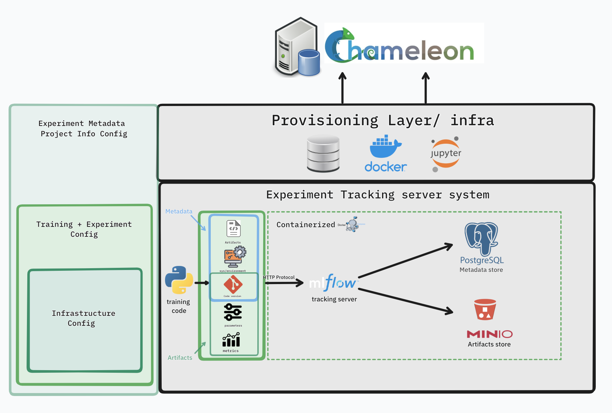

### About the Project 
Hello! I'm Ahmed, an undergraduate Computer Science student at the University of Khartoum I'm working on making machine learning research more reproducible for open access research facilities like [Chameleon testbed](chameleoncloud.org), under the project [Applying MLOps to overcome reproducibility barriers in machine learning research](https://ucsc-ospo.github.io/project/osre25/nyu/mlops/), mentored by Prof. [Fraida Fund](https://ucsc-ospo.github.io/author/fraida-fund/) and [Mohamed Saeed](https://ucsc-ospo.github.io/author/mohamed-saeed/). as part of this project my [proposal](https://docs.google.com/document/d/146PutdVy7cWSf_Gn8qcn0Ba2llMHjNtHIQzZ5a-xRvQ/edit?usp=sharing) aims to build a template generator that generates repositories for reproducible model training on the Chameleon testbed.

### Reproducibility
> *We argue that unless reproducing research becomes as vital and mainstream part of scientific exploration as reading papers is today, reproducibility will be hard to sustain in the long term because the incentives to make research results reproducible won’t outweigh the still considerable costs*
>
> — [Three Pillars of Practical Reproducibility Paper](https://www.chameleoncloud.org/media/filer_public/25/18/25189b96-c3a2-4a55-b99b-c25322fe6682/reproducibility_on_chameleon-3.pdf)

By Reproducibility in science we refer to the ability to obtain consistent results using the same methods and conditions as the previous study. in simple words if I used the same data and metholodgy that was used before, I should obtain the same results. this principle is mapped to almost every scientific field including both Machine Learning research in science and core Machine Learning.

### Challenges in Reproducibility

The same way the famous paper about the [repoducibility crisis in science](https://www.nature.com/articles/d41586-019-00067-3) was published in in 2016, similar discussions have been published discussing this in machine learning research setting, the [paper state of the art reproducibility in artificial intelligence](https://ojs.aaai.org/index.php/AAAI/article/view/11503) after analayzing 400 hundereds papers from top AI conferences, it was found that around 6% shared code, approximately 33% shared test data. In contrast, 54% only shared a pseudocode (summary of the algorithm). 

The lack of software dependency management, proper version control, log tracking, and effective artifacts sharing made it very difficult to reproduce research in machine learning.

Reproducibility in ML is largely driven by well-established MLOps practices.However, in academic settings reproducibility remains a great challenge, the adaptation and standardization of these practices progress slowly, the best way to ensure is to seamleas experience with MLOps, is to make these capabilities are easily accessible to the researchers' workflow. by developing a tool that steamlines the process of provisioning resources, enviornment setup, model training and artifacts tracking, that ensures reproducible results.

### Proposed Solution

We want researcher to spin up ML research instances/bare metal on Chameleon testbed while keeping the technical complexity involved in configuring and stitching everything together abstracted, the user answers basic questions about the project info, frameworks, tools, features and integrations if there are any and have a full generated project that is reproducible. it contains a provisioning/infrastracture config layer for provisioning resources on the cloud, a dockerfile to spin up services and presistent storage for data,the ML code at its core is backed by ML tracking server system that logs the artifacts, metadata, environment configuration, system specification (GPUs type) and Git status using Mlflow, powered by a postgresSQL for storing metadata and a S3 Minio bucket to store artifacts.
persistent storage for the artifacts generated from the experiment and the datasets and containarization of all these to ensure reproducibility.we aim to make the cloud experience easier, by dealing with the configuration needed for setting up the environment having a 3rd party framework, enabling seamless access to benchmarking dataset or any necessary components from services like Hugging face and GitHub as an example will be accessible from the container easily.  for more techincal details about the solution you can read my propsal [here](https://docs.google.com/document/d/1ilm-yMEq-UTiJPGMl8tQc3Anl5cKM5RD2sUGInLjLbU).

By addressing these challenges we can accelerate the scientific discovery. this not benefits those who are conducting the research but also the once building on top of it in the future. I look forward to share more updates as the project progresses and I welcome feedback from others interested in advancing reproducibility in ML research.