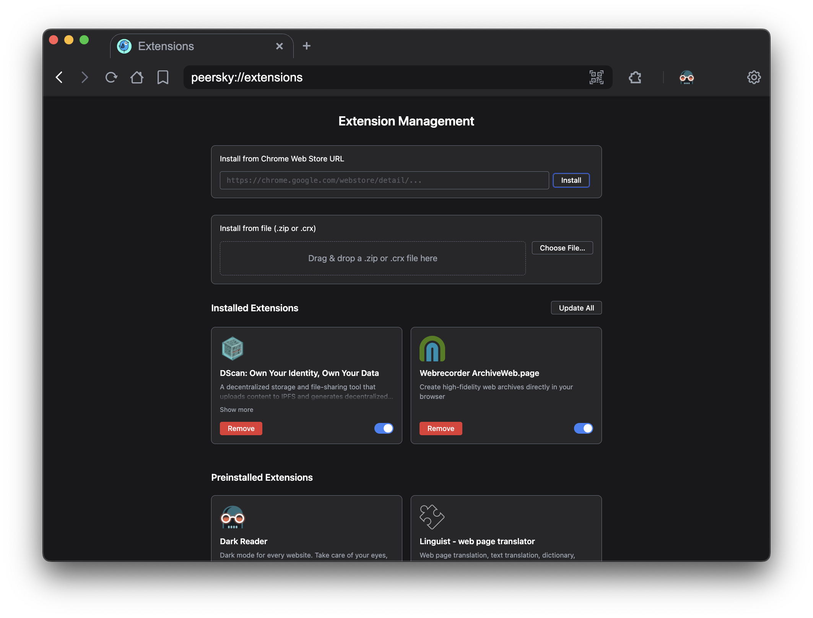

Hi everyone, I’m Hanzhong Liu. Over the summer I worked on building the `peersky://extensions` system for [PeerSky browser](https://github.com/p2plabsxyz/peersky-browser), a decentralized and privacy-first browser built on Electron.

This post is my final GSoC 2025 update — covering how the extensions manager was designed, the security model behind IPC, the UI for managing extensions, and what’s next for PeerSky.

## Project Overview

The new extensions system makes PeerSky behave like a modern browser: you can install extensions from the Chrome Web Store or from local files, enable/disable them, update or uninstall, and interact with their toolbar actions through a puzzle-menu UI.

### Key Design Goals
- Secure preload-based API exposure via `contextBridge`
- Support for preinstalled, Web Store, and local packages
- Toolbar integration with pin/unpin support (up to six)
- Robust validation: MV3-only, size caps, zip-slip prevention

## Highlights

### Preinstalled MV3s
PeerSky now ships with three trusted extensions out of the box:
- Dark Reader  
- Linguist (web page translator)  
- uBlock Origin Lite  

They remain installed by default but can be disabled at any time. This ensures users always have a working baseline without needing to browse an extension store.

### Electron Integration
Instead of injecting scripts, the system uses **preload + IPC**. Each operation is routed through validated IPC channels:
- `listExtensions`, `installFromWebStore`, `toggleExtension`, etc.  
- All methods are scoped to `peersky://extensions` only.  
- Rate limiting and size caps are enforced per renderer.

This design makes the surface auditable and prevents privilege leaks.

### Toolbar & Puzzle Menu
Browser actions appear in a puzzle menu and can be pinned for quick access:
- Up to six pins are allowed
- Pinned state persists across sessions.  
- Popups (e.g., for translators or wallets) open in isolated windows, with OAuth flows preserved via popup guards.

### Security Highlights
- Installs capped at **60 MB**, with early rejection on oversized payloads  
- **5 installs/minute** per renderer to prevent abuse  
- ZIP/CRX extraction hardened against path traversal  
- MV3 required; permissions validated at install with warnings for risky hosts  
- Web Store installs use Google-signed CRX verification via `electron-chrome-web-store`

## Example: Installing from the Web Store

Adding a new extension is simple:
1. Paste a Chrome Web Store URL or ID into the install bar.  
2. PeerSky downloads and validates the CRX.  
3. On success, the extension appears in the grid with toggle, update, and remove options.  

## Reflection

This project was both challenging and rewarding. Designing an extension system meant grappling with security, IPC design, and user experience at the same time. I learned to think carefully about security management, UI/UX positioning, and design APIs that are auditable.

I’m grateful to my mentor Akhilesh Thite and the UC OSPO team for their guidance and feedback. Their support pushed me to make deliberate technical decisions and communicate them clearly.

You can explore the project here:
https://github.com/p2plabsxyz/peersky-browser
