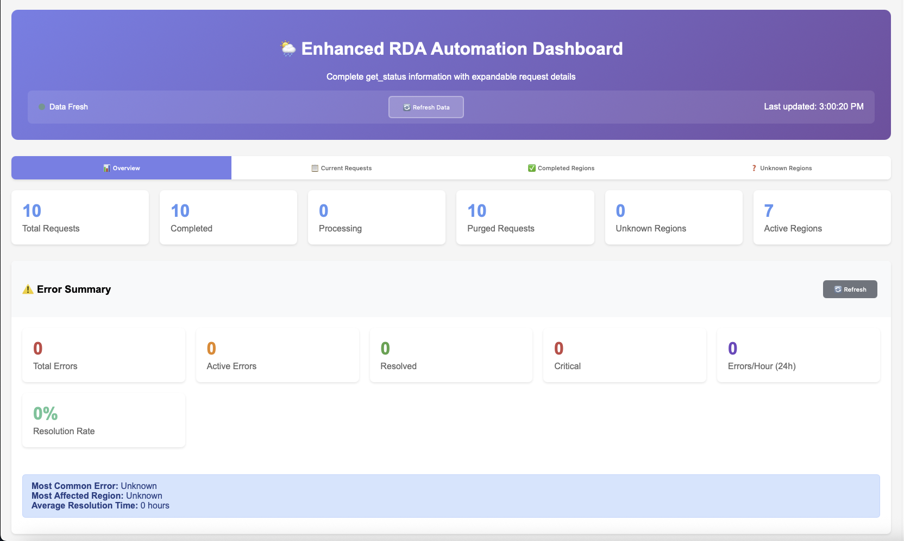
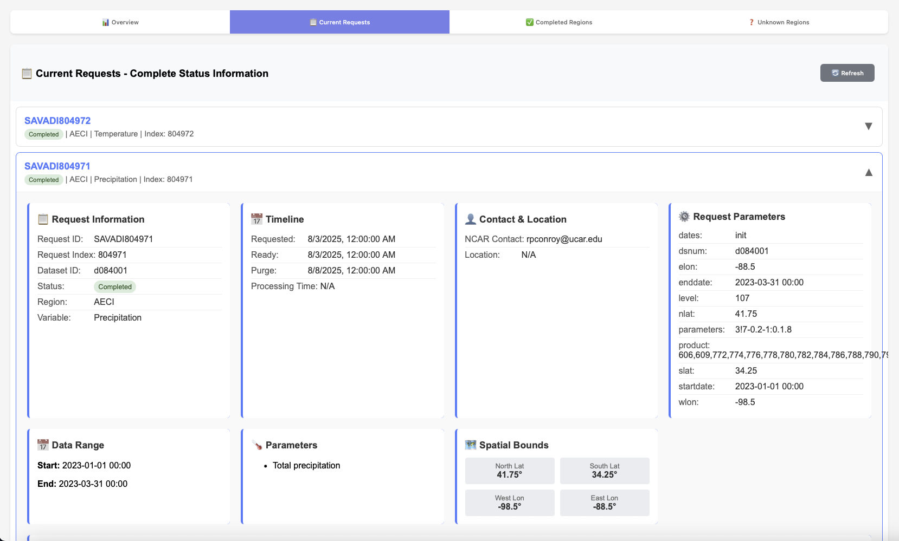
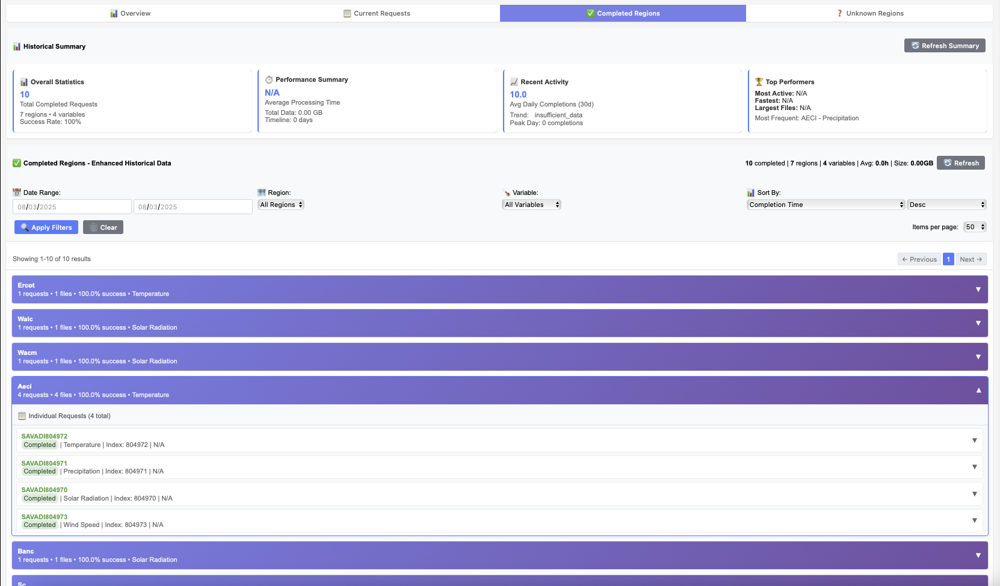
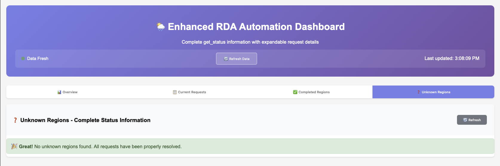

A few months ago, I shared my vision for making carbon intensity forecasts more accessible through the [CarbonCast project](/project/osre25/ucsc/carboncast). My [proposal](https://summerofcode.withgoogle.com/programs/2025/projects/7yvAix3k) under the mentorship of Professor Abel Souza aims to build an API that makes carbon intensity forecasts more accessible and actionable. I had two main goals: expand CarbonCast to work with more regional electricity grids, and transform it from a research project into something that could actually run and be interacted with in the real world.

Today, I'm excited to share that we've not only hit those goals – we've exceeded them in ways I didn't expect.

## What We've Built So Far
Remember how I mentioned that CarbonCast needed to support more regional grids? Well, we've gone big. The system now covers 85+ regions across two continents. We're talking about major US grid operators like ERCOT (Texas), CISO (California), PJM (Mid-Atlantic), MISO (Midwest), and NYISO (New York), plus we've expanded into European countries like Germany, France, Spain, and the UK.

But here's the thing – collecting weather data for carbon intensity forecasting isn't as simple as just downloading a few files. Each region needs four different types of weather data: solar radiation (for solar power predictions), wind patterns (for wind power), temperature and humidity (for energy demand), and precipitation (which affects both supply and demand). That means we're managing data collection for over 340 different combinations of regions and weather variables.

## The Automation Challenge
When I started this project, I quickly realized that manually managing data collection for this many regions would be impossible. We're talking about thousands of data requests, each taking time to process, with various things that can go wrong along the way.

So we built something I'm really proud of: an intelligent automation system that handles 95% of the work without human intervention. That means 19 out of every 20 data collection tasks happen automatically, even when things go wrong.

The system is smart about it too. It knows when to speed up data collection, when to slow down to avoid overwhelming the servers, and how to recover when errors happen. We've achieved 99% data completeness, which means almost every piece of weather data we need actually makes it into our system successfully.

## Making It Production-Ready
The biggest challenge was taking CarbonCast from a research project that worked on my laptop to something that could run reliably for weeks without me babysitting it. This meant building in all the boring but crucial stuff that makes software actually work in the real world.

We created a comprehensive error handling system that can automatically recover from 95% of the problems it encounters. Network hiccups, server timeouts, data format changes – the system handles these gracefully and keeps running.

There's also a real-time monitoring dashboard that shows exactly what's happening across all regions. I can see which areas are collecting data successfully, which ones might be having issues, and get alerts if anything needs attention. It's like having a mission control center for carbon data.

## The Dashboard: Mission Control for Carbon Data

Let me show you what this monitoring system actually looks like. We built a comprehensive web dashboard that gives us real-time visibility into everything that's happening:

*The main dashboard showing real-time system metrics and status across all regions*

The dashboard shows key metrics at a glance – total requests, completion rates, and active regions. But it goes much deeper than that. You can drill down into individual requests to see their complete lifecycle:

*Detailed view of individual data requests showing processing timelines and status*

Each request card shows everything from the initial request time to when the data becomes available for download. This level of visibility is crucial when you're managing hundreds of data requests across different regions and weather variables.

The regional analytics view shows how well we're doing across different grid operators:

*Regional breakdown showing completion status across different electricity grid operators*

What I'm particularly proud of is the error handling dashboard. When things do go wrong (which they inevitably do with any large-scale data system), we can see exactly what happened and how the system recovered:

*Error tracking and resolution system showing 100% success rate in region mapping*

The fact that we're showing "No unknown regions found" means our coordinate-based region detection system is working perfectly – every weather data request gets properly mapped to the right electricity grid.

## The Technical Foundation
Under the hood, we've built what I'd call enterprise-grade infrastructure. The system can run autonomously for weeks, automatically organizing data by region and weather type, managing storage efficiently, and even optimizing its own performance based on what it learns.

We've also created comprehensive testing systems to make sure everything works reliably. When you're dealing with data that people might use to make real decisions about when to charge their electric vehicles or run their data centers, reliability isn't optional.

The architecture follows a modular, service-oriented design with clear separation between data collection, processing, monitoring, and user interfaces. This makes it much easier to maintain and extend as we add new features.

## Why This Matters
All of this infrastructure work might sound technical, but it's directly connected to the original vision: making carbon intensity forecasts accessible to everyone.

With this foundation in place, we can now provide reliable, up-to-date weather data for carbon intensity forecasting across major electricity grids in North America and Europe. That means developers building carbon-aware applications, companies trying to reduce their emissions, and individuals wanting to time their energy use for lower environmental impact all have access to the data they need.

## What's Next: Breaking Down CarbonCast
The next phase is where things get really exciting. Now that we have this solid data collection foundation, we're going to break down CarbonCast itself into modular components. This will make it easier for developers to integrate carbon intensity forecasting into their own applications, whether that's a smart home system, a cloud computing platform, or a mobile app that helps people make greener energy choices.

## Looking Back
When I started this project, I knew we needed better infrastructure for carbon data. What I didn't expect was how much we'd end up building – or how well it would work. We've created something that can reliably collect and organize weather data across two continents, handle errors gracefully, and run without constant supervision.

More importantly, we've built the foundation that will make it possible for anyone to access accurate carbon intensity forecasts. Whether you're a developer building the next generation of carbon-aware applications or someone who just wants to know the best time to do laundry to minimize your environmental impact, the infrastructure is now there to support those decisions.

The vision of making carbon data accessible and actionable is becoming reality, one automated data collection at a time.

## Impact Beyond Research
This work builds directly on the foundation of Multi-day Forecasting of Electric Grid Carbon Intensity using Machine Learning, transforming research into practical, real-world infrastructure. We're not just making carbon intensity forecasts more accurate – we're making them accessible to everyone who wants to reduce their environmental impact.

The open-source nature of CarbonCast means that anyone can run, contribute to, and benefit from this work. Whether you're a developer building carbon-aware applications, a policymaker working on grid decarbonization strategies, or a sustainability-conscious individual looking to reduce your carbon footprint, the tools are now there to make informed, impactful choices.

Looking ahead, I'm excited to see how this infrastructure will enable the next generation of carbon-aware computing and smart energy decisions.