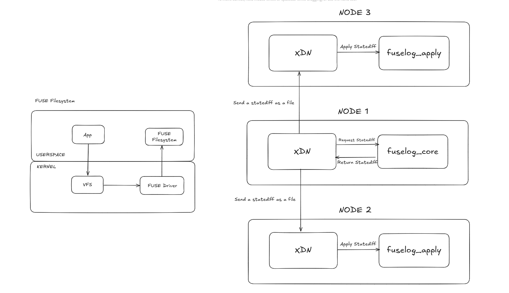
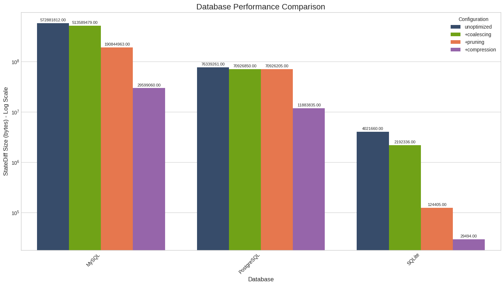
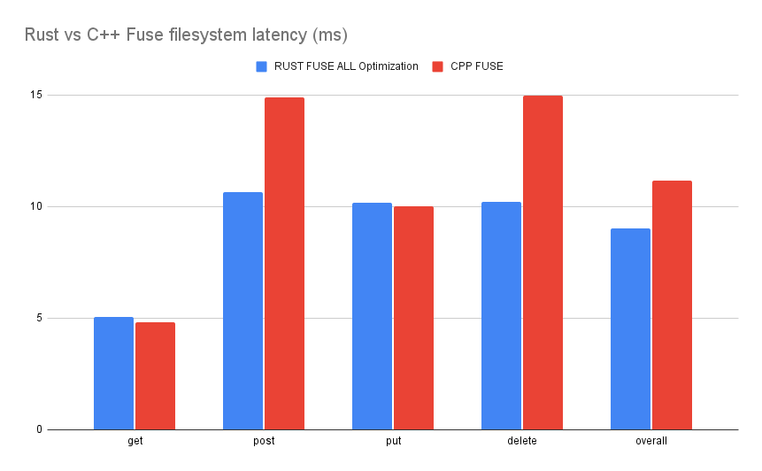

Hello! I'm Panji Sri Kuncara Wisma and I want to share my midterm progress on the "Open Testbed for Reproducible Evaluation of Replicated Systems at the Edges" project under the mentorship of Fadhil I. Kurnia.

## Project Overview

The goal of our project is to create an open testbed that enables fair, reproducible evaluation of different consensus protocols (Paxos variants, EPaxos, Raft, etc.) when deployed at network edges. Currently, researchers struggle to compare these systems because they lack standardized evaluation environments and often rely on mock implementations of proprietary systems.

XDN (eXtensible Distributed Network) is one of the important consensus systems we plan to evaluate in our benchmarking testbed. Built on GigaPaxos, it allows deployment of replicated stateful services across edge locations. As part of preparing our benchmarking framework, we need to ensure that the systems we evaluate, including XDN, are robust for fair comparison.

## Progress

As part of preparing our benchmarking tool, I have been working on refactoring XDN's FUSE filesystem from C++ to Rust. This work is essential for creating a stable and reliable XDN platform.

The diagram above illustrates how the FUSE filesystem integrates with XDN's distributed architecture. On the left, we see the standard FUSE setup where applications interact with the filesystem through the kernel's VFS layer. On the right, the distributed replication flow is shown: Node 1 runs `fuselog_core` which captures filesystem operations and generates statediffs, while Nodes 2 and 3 run `fuselog_apply` to receive and apply these statediffs, maintaining replica consistency across the distributed system.

This FUSE component is critical for XDN's operation as it enables transparent state capture and replication across edge nodes. By refactoring this core component from C++ to Rust, we're hopefully strengthening the foundation for fair benchmarking comparisons in our testbed.

### Core Work: C++ to Rust FUSE Filesystem Migration

XDN relies on a FUSE (Filesystem in Userspace) component to capture filesystem operations and generate "statediffs" - records of changes that get replicated across edge nodes. The original C++ implementation worked but had memory safety concerns and limited optimization capabilities.

I worked on refactoring from C++ to Rust, implementing several improvements:

**New Features Added:**
- **Zstd Compression**: Reduces statediff payload sizes
- **Adaptive Compression**: Intelligently chooses compression strategies
- **Advanced Pruning**: Removes redundant operations (duplicate chmod/chown, created-then-deleted files)
- **Bincode Serialization**: Helps avoid manual serialization code and reduces the risk of related bugs
- **Extended Operations**: Added support for additional filesystem operations (mkdir, symlink, hardlinks, etc.)

**Architectural Improvements:**
- **Memory Safety**: Rust's ownership system helps prevent common memory management issues
- **Type Safety**: Using Rust enums instead of integer constants for better type checking

## Findings

The optimization results performed as expected:

**Statediff Size Reductions:**
- **MySQL workload**: 572MB → 29.6MB (95% reduction)
- **PostgreSQL workload**: 76MB → 11.9MB (84% reduction)  
- **SQLite workload**: 4MB → 29KB (99% reduction)

The combination of write coalescing, pruning, and compression proves especially effective for database workloads, where many operations involve small changes to large files.

**Performance Comparison:**
Remarkably, the Rust implementation matches or exceeds C++ performance:
- **POST operations**: 30% faster (10.5ms vs 15ms)
- **DELETE operations**: 33% faster (10ms vs 15ms)
- **Overall latency**: Consistently better (9ms vs 11ms)

## Current Challenges

While the core implementation is complete and functional, I'm currently debugging occasional latency spikes that occur under specific workload patterns. These edge cases need to be resolved before moving on to the benchmarking phase, as inconsistent performance could compromise the reliability of the evaluation.

## Next Steps

With the FUSE filesystem foundation nearly complete, next steps include:

1. **Resolve latency spike issues** and complete XDN stabilization
2. **Build benchmarking framework** - a comparison tool that can systematically evaluate different consensus protocols with standardized metrics.
3. **Run systematic evaluation** across protocols

The optimized filesystem will hopefully provide a stable base for reproducible performance comparisons between distributed consensus protocols.