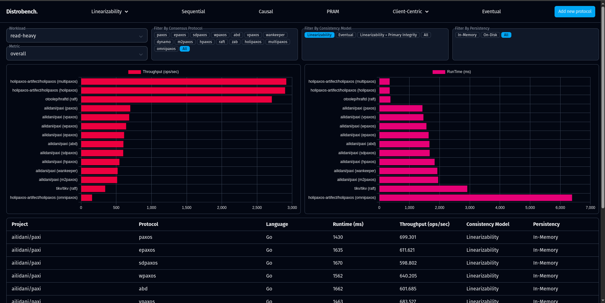

---  
title: "[Final Blog] Distrobench: Distributed Protocol Benchmark"  
subtitle: ""  
summary: ""  
authors: [PanjiSri, mchan]  
tags: [osre25, reproducibility, distributed systems, edge, coordination protocols]  
categories: [SoR]  
date: 2025-08-30  
lastmod: 2025-08-30  
featured: false  
draft: false

# Featured image  
# To use, add an image named `featured.jpg/png` to your page's folder.  
# Focal points: Smart, Center, TopLeft, Top, TopRight, Left, Right, BottomLeft, Bottom, BottomRight.  
image:  
  caption: ""  
  focal_point: ""  
  preview_only: false  
---

## Introduction

This is the final blog for our contribution to the [Open Testbed for Reproducible Evaluation of Replicated Systems at the Edges](/project/osre25/umass/edge-replication/) project under the mentorship of {} for the OSRE program.

[Distrobench](https://github.com/fadhilkurnia/distro) is a framework to evaluate the performance of replication/coordination protocols for distributed systems. This framework standardizes benchmarking by allowing different protocols to be tested under an identical workload, and supports both local and remote deployment of the protocols. The frameworks tested are restricted under a key-value store application and are categorized under different [consistency models](https://jepsen.io/consistency/models), programming languages, and persistency (whether the framework stores its data in-memory or on-disk).

All the benchmark results are stored in a `data.json` file which can be viewed through a webpage we have provided. A user can clone the git repository, benchmark different protocols on their own machine or in a cluster of remote machines, then view the results locally. We also provided a [webpage](https://distrobench.org) that shows our own benchmark results which ran on 3 Amazon EC2 t2.micro instances.  
  

## How to run a benchmark on Distrobench

Before running a benchmark using Distrobench, the protocol that will be benchmarked must first be built. This is to allow the script to initialize the protocol instance for local benchmark or to send the binaries into the remote machine. The remote machine running the protocol does not need to store the code for the protocol implementations, but does require dependencies for running that specific protocol such as Java, Docker, rsync, etc. The following are commands used to build the [ailidani/paxi](https://github.com/ailidani/paxi) project which does not need any additional dependency to be run inside of a remote machine:  
```sh  
# Clone the Distrobench repository  
git clone git@github.com:fadhilkurnia/distro.git

# Clone the Paxi repository and build the binary  
cd distro/sut/ailidani.paxi  
git clone git@github.com:ailidani/paxi.git  
cd paxi/bin/  
./build.sh

# Go back to the Distrobench root directory & run python script  
cd ../../../..  
python main.py  
```  
By default, the script will start 3 local instances of a Paxi protocol implementation that the user chose through the CLI. The user can modify the number of running instances and whether or not it is deployed locally or in a remote machine by changing the contents of the `.env` file inside the root directory. The following is the contents of the default .env file:  
```  
NUM_OF_NODES=3

SSH_KEY=ssh-key.pem  
REMOTE_USERNAME=ubuntu

PUBLIC_IP1=127.0.0.1  
PUBLIC_IP2=127.0.0.1  
PUBLIC_IP3=127.0.0.1

PRIVATE_IP1=127.0.0.1  
PRIVATE_IP2=127.0.0.1  
PRIVATE_IP3=127.0.0.1

CLIENT_IP=127.0.0.1

OUTPUT=data.json  
```  
When running a remote benchmark, a ssh-key should also be added in the root directory to allow the use of ssh and rsync from within the python script. All machines must also allow TCP connection through port 2000-2300 and port 3000-3300 because that would be the port range for communication between the running instances as well as for the YCSB benchmark. Running the benchmark requires the use of at least 3 nodes because it is the minimum number of nodes to support most protocols (5 nodes recommended).

To view the benchmark result in the web page locally, move `data.json` into the `docs/` directory and run `python -m http.server 8000`. The page is then accessible through `http://localhost:8000`. 

## Deep dive on how Distrobench works

The following is the project structure of the Distrobench repository:  
```  
distro/  
├── main.py                 // Main python script for running benchmark  
├── data.json               // Output file for main.py  
├── README.md  
├── .env		// Config for running the benchmark  
├── docs/  
│   ├── index.html          // Web page to show benchmark results  
│   ├── data.json           // Output file displayed by web page  
│   ├── README.md  
├── src/  
│   ├── utils/  
│   └── ycsb/               // Submodule for YCSB  
└── sut/                    // Systems under test  
    ├── ailidani.paxi/  
        └── run.py          // Protocol-specific benchmark script called by main.py  
    ├── apache.zookeeper/  
    ├── etcd-io.etcd/  
    ├── fadhilkurnia.xdn/  
    ├── holipaxos-artifect.holipaxos/  
    ├── otoolep.hraftd/  
    └── tikv.tikv/  
```  
`main.py` will automatically detect directories inside `sut/` and will call the main function inside `run.py`. The following is the structure of `run.py` written in pseudocode style:  
```  
FUNCTION main(run_ycsb: Function, nodes: List of Nodes, ssh: Dictionary)  
    node_data = map_ip_port(nodes)  
      
    SWITCH user\_input  
        CASE 0:  
            start()  
            RETURN  
        CASE 1:  
            stop()  
            RETURN  
        CASE 2:  
            client_data = []  
            FOR EACH item IN node_data  
                ADD item.client_addr TO client_data  
            END FOR  
            run_ycsb(client_data)  
            RETURN  
    END SWITCH  
END FUNCTION

FUNCTION start()  
    // Start the protocol instance (local or remote)  
END FUNCTION

FUNCTION stop()  
    // Stop the protocol instance (local or remote)  
END FUNCTION

FUNCTION map_ip_port(nodes: List of Nodes) -> List of Dictionary  
    // Generate port numbers based on the protocol requirements  
END FUNCTION  
```  
The .env file provides both public and private IP addresses to add versatility when running a remote benchmark. Private IP is used for communication between remote machines if they are under the same network group. In the case of our own benchmark, four t2.micro EC2 instances are deployed under the same network group. Three of them are used to run the protocol and the fourth machine acts as the YCSB client. It is possible to use your local machine as the YCSB client instead of through another remote machine by specifying `CLIENT_IP` in the .env file as `127.0.0.1`. The decision to use the remote machine as the YCSB client is made to reduce the impact of network latency between the client and the protocol servers to a minimum.

The main tasks of the `start()` function can be broken down into the following:  
1. Generate custom configuration files for each remote machine instance (May differ between implementations. Some implementations does not require a config file because they support flag parameters out of the box, others require multiple configuration files for each instance)  
2. rsync binaries into the remote machine (If running a remote benchmark)  
3. Start the instances

The `stop()` function is a lot simpler since it only kills the process running the protocol and optionally removes the copied binary files in the remote machine. The `run_ycsb()` function passed onto `run.py` is defined in `main.py` and currently supports two types of workload:  
1. Read-heavy: A single-client workload with 95% read and 5% update (write) operations  
2. Update-heavy: A single-client workload with 50% read and 50% update (write) operations

A new workload can be added inside the `src/ycsb/workloads` directory. Both workloads above only run 1000 operations for the benchmark which may not be enough operations to properly evaluate the performance of the protocols. It should also be noted that while YCSB does support a `scan` operation, it is never used for our benchmark because none of our tested protocols implement this operation.  

### How to implement a new protocol in Distrobench

Adding a new protocol to distrobench requires implementing two main components: a Python integration script (`run.py`) and a YCSB database binding for benchmarking.

1. Create the protocol directory structure  
   - Create a new directory under `sut/` using format `yourrepo.yourprotocol/.`   
2. Write `run.py` integration   
   - Put script inside yourrepo.yourprotocol/ directory

   - Must have the `main(run_ycsb, nodes, ssh)` function.  
   - Add start/stop/benchmark menu options  
   - Handle local (127.0.0.1) and remote deployment

3. Create YCSB client  
   - Make Java class extending YCSB's DB class  
   - Put inside `src/ycsb/yourprotocol/src/main/java/site/ycsb/yourprotocol`  
   - Implement `read()`, `insert()`, `update()`, `delete()` methods  
4. Register your client  
   - Register your client to `src/pom.xml`, `src/ycsb/bin/binding.properties`, and `src/ycsb/bin/ycsb`.  
5. Build and test  
   - Run `cd src/ycsb && mvn clean package`   
   - Run python `main.py`
   - Select your protocol and test it

## Protocols which have been tested

Distrobench has tested 20 different distributed consensus protocols across 7 different implementation projects. 

1. [ailidani/paxi](https://github.com/ailidani/paxi)    
   - Programming Language : Go  
   - Persistency : On-Disk  
   - Consistency Model : Linearizability, Eventual  
   - Protocol : Paxos, EPaxos, SDpaxos, WPaxos, ABD, chain, VPaxos, WanKeeper, KPaxos, Paxos_groups, Dynamo, Blockchain, M2Paxos, HPaxos.  
     
2. [apache/zookeeper](https://github.com/apache/zookeeper)   
   - Programming Language : Java  
   - Persistency : On-Disk  
   - Consistency Model :  Linearizability + Primary Integrity  
   - Protocol : Zookeeper implements ZAB (Zookeper Atomic Broadcast)   
     
3. [etcd-io/etcd](https://github.com/etcd-io/etcd)   
   - Programming Language : Go  
   - Persistency : On-Disk  
   - Consistency Model : Linearizability  
   - Protocol : Raft

4. [fadhilkurnia/xdn](https://github.com/fadhilkurnia/xdn)  
   - Programming Language : Java, Rust  
   - Persistency : On-Disk  
   - Consistency Model : Linearizability, Linearizability + Primary Integrity  
   - Protocol : Gigapaxos

5. [Zhiying12/holipaxos-artifect](https://github.com/Zhiying12/holipaxos-artifect)  
   - Programming Language : Go, Rust  
   - Persistency : On-Disk  
   - Consistency Model : Linearizability  
   - Protocol : Holipaxos, Omnipaxos, Multipaxos

6. [otoolep/hraftd](https://github.com/otoolep/hraftd)   
   - Programming Language : Go  
   - Persistency : On-Disk  
   - Consistency Model : Linearizability  
   - Protocol : Raft  
     
7. [tikv/tikv](https://github.com/tikv/tikv)   
   - Programming Language : Rust  
   - Persistency : On-Disk  
   - Consistency Model : Linearizability  
   - Protocol : Raft

## Challenges

- When attempting to benchmark HoliPaxos, the main challenge was handling versions that rely on persistent storage with RocksDB. Since some implementations are written in Go, it was necessary to find compatible versions of RocksDB and gRocksDB (for example, RocksDB 10.5.1 works with gRocksDB 1.10.2). Another difficulty was that RocksDB is resource-intensive to compile, and in our project we did not have sufficient CPU capacity on the remote machine to build RocksDB and run remote benchmarks.  
- Some projects did not compile successfully at first and required minor modifications to run.

## Conclusion and future improvements

The current benchmark result shows the performance of all the mentioned protocols by throughput and benchmark runtime. The results are subject to revisions because it may not reflect the best performance for the protocols due to unoptimized deployment script. We are also planning to switch to a more powerful EC2 machine because t2.micro does not have enough resources to support the use of RocksDB as well as TiKV.

In the near future, additional features will be added to Distrobench such as:
- **Multi-Client Support:** The YCSB client will start multiple clients which will send requests in parallel to different servers in the group.
- **Commit Versioning:** Allows the labelling of all benchmark results with the commit hash of the protocol's repository version. This allows comparing different versions of the same project.
- **Adding more Primary-Backup, Sequential, Causal, and Eventual consistency protocols:** Implementations with support for a consistency model other than linearizability and one that provides an existing key-value store application are notoriously difficult to find.
- **Benchmark on node failure**
- **Benchmark on the addition of a new node**
