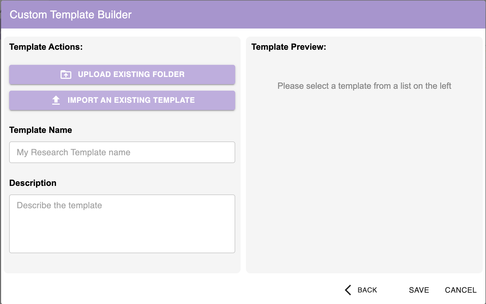
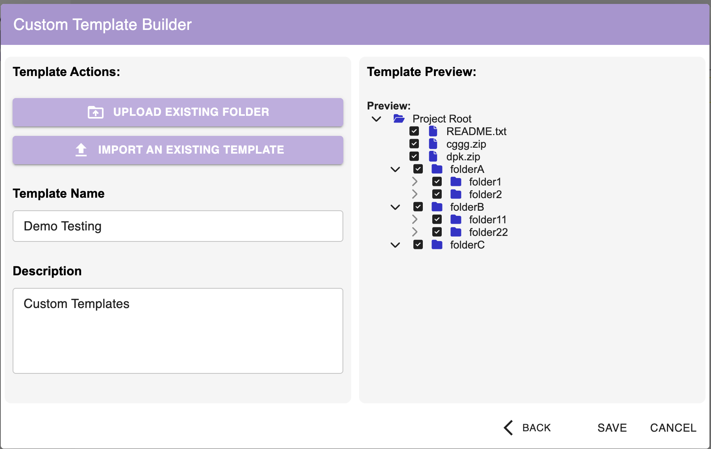
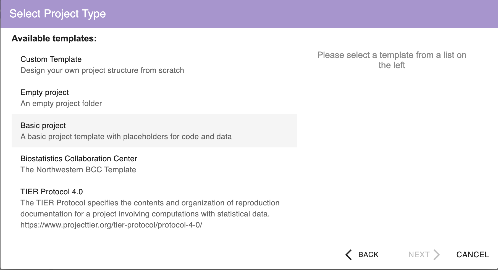
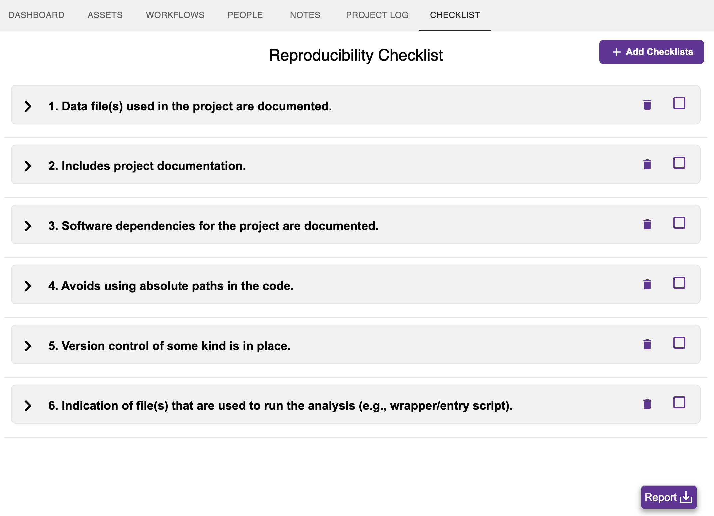
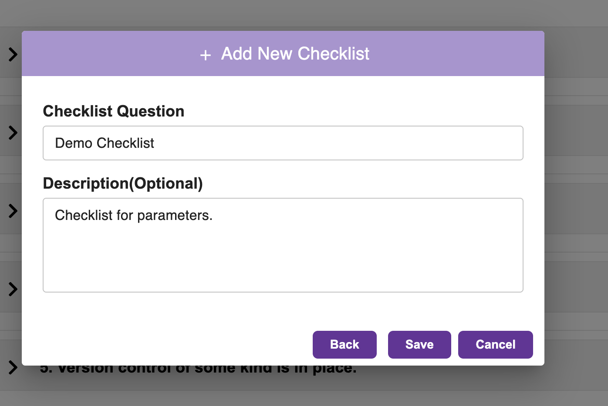

## Introduction

Hello everyone!
I'm {}, an undergraduate studying Electrical Engineering at National Institute of Technology Agartala, India. As part of the [StatWrap: Group and Individual Customizations](/project/osre26/northwestern/statwrap/) project, my [proposal](https://docs.google.com/document/d/17IxWc-m0opZdSriHxedDrdlh_M0gPVVBOz5l3enufQU/edit?usp=sharing), under the mentorship of {}, focuses on making StatWrap's project templates, reproducibility checklists, and asset attributes fully customizable and shareable — so researchers can customize the tool to how they actually work.

## About the Project

[StatWrap](https://stattag.github.io/StatWrap/) is a free, open-source tool that helps researchers document and track their projects for reproducibility. It inventories project assets — code files, data files, manuscripts, documentation - and organizes information to help identify changes that could affect reproducibility over time.

Currently, features like the directory template for creating new projects and the reproducibility checklist are static: everyone who downloads StatWrap gets the exact same configuration. But every researcher and team works differently. My project is about changing that — letting users create, modify, share, and reuse their own project templates and reproducibility checklists, while also improving the flexibility of file-level asset attributes. All of this needs to work securely and reliably.

## Progress

It's been over six weeks since the program started, and I've made solid progress across two major deliverables. Here's a breakdown:

### 1. Custom Template Builder

This was the first major piece of the project. I built a complete Custom Template Builder that lets users design their own project directory structures - either from scratch or by seeding from an existing project.

**What's been implemented:**

* **Upload Existing Folder** — Users can select an existing folder from their system. StatWrap scans its directory hierarchy recursively and presents an interactive tree view where users can cherry-pick which files and folders to include in the template.

* **File Selection & Security Filtering** — The tree view uses checkboxes for granular control. I implemented security filtering that blocks potentially malicious file types from being included in templates, keeping shared configurations safe.

* **Template Preview** — A live preview panel on the right side of the builder shows the selected directory structure in real time, making it easy to verify the layout before saving.

* **Save & Manage Templates** — Custom templates are saved locally and appear alongside StatWrap's built-in templates in the project creation workflow. Users can give each template a name and description.

* **Export as ZIP** — Users can export any custom template as a `.zip` file, making it straightforward to share configurations with collaborators or across institutions.

* **Import with Security Checks** — On the receiving end, users can import a template from a `.zip` file. The import pipeline includes rigorous validation — checking the archive structure, filtering out restricted file types, and ensuring the template configuration is well-formed before adding it to the user's local instance.

### 2. Custom Reproducibility Checklist

StatWrap ships with six default reproducibility checklist items (e.g., "Data files used in the project are documented,"). My work extends this so users can add their own items that reflect their institution-specific or project-specific needs.

**What's been implemented:**

* **Add Custom Checklist Items** — A "+ Add Checklists" button opens a dialog where users can enter a checklist question along with an optional description. The interface is clean and intuitive.

* **Persistent Storage** — Custom checklist items are saved alongside the defaults and persist across sessions.

* **Drag-to-Reorder** — All checklist items — both default and custom — can be reordered via drag-and-drop, so users can prioritize what matters most to their workflow.

* **Consistent Numbering with UUIDs** — Each checklist item is tracked internally using UUIDs, which means numbering stays consistent even when items are reordered, added, or removed. The displayed numbers dynamically update to reflect the current order.

* **Edit & Delete** — Every checklist item has edit and delete options. Users can update the question text or description at any time, or remove items they no longer need.

* **Description Tooltip** — A `(?)` icon next to each item reveals its description on hover, keeping the interface clean while still surfacing context when needed.

* **Snackbar with Undo** — Destructive actions (like deleting a checklist item) trigger a snackbar notification with an **Undo** option, giving users a safety net before the change is finalized.

### 3. Comprehensive Jest Testing

Alongside feature development, I've been writing detailed Jest test suites covering:

* Template creation, saving, and loading workflows
* File scanning and malicious file filtering logic
* ZIP export and import pipelines, including edge cases
* Checklist CRUD operations (create, read, update, delete)
* Reorder logic and UUID consistency verification

## Challenges

* **Security in Import/Export** — Designing the import pipeline to be robust against malformed or malicious ZIP archives required careful thought. I needed to validate not just individual file types, but also the overall archive structure and configuration integrity before allowing an import.

* **State Management for Reordering** — Keeping checklist numbering consistent while supporting drag-and-drop reordering, additions, and deletions turned out to be trickier than expected. UUID-based tracking was the right solution over simple index-based approaches.

* **Balancing Flexibility and Simplicity** — The UI needed to expose powerful customization without overwhelming users. Design decisions like the split-panel layout for the template builder and keeping the checklist interface minimal with expandable descriptions helped strike that balance.

## End-Term Goals

With the template builder and checklist customization well underway, here's what's next:

* **Checklist Templates** — Building import/export functionality for reproducibility checklist configurations, mirroring what's already done for project templates
* **Asset (File) Attribute Configuration** — Developing a configuration scheme that lets users define custom attributes for file-level assets
* **Polish & Edge Cases** — Handling additional edge cases, improving error messaging, and ensuring the entire customization workflow is smooth end-to-end
* **Expanded Test Coverage** — Adding more integration-level tests and covering the newer checklist features

Stay tuned for the final update! 