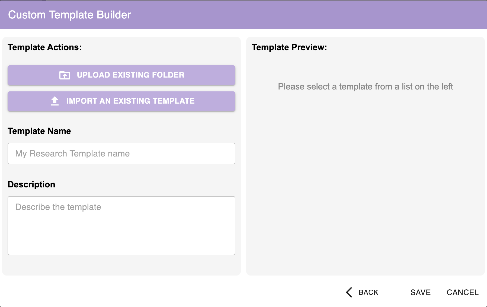
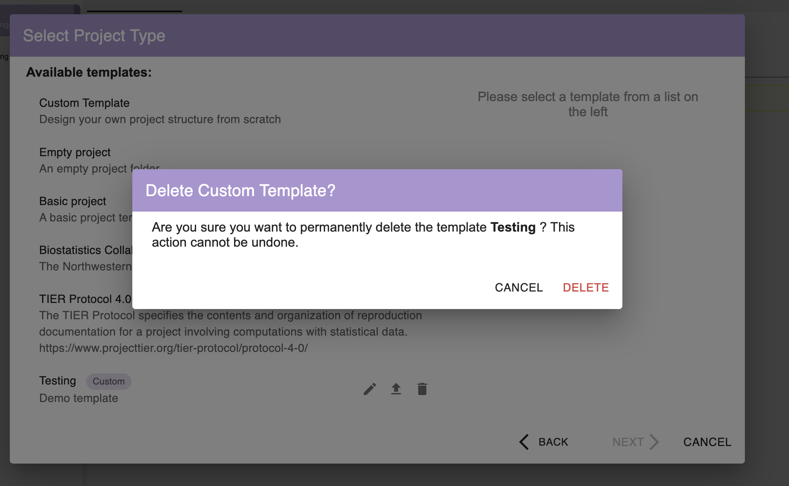
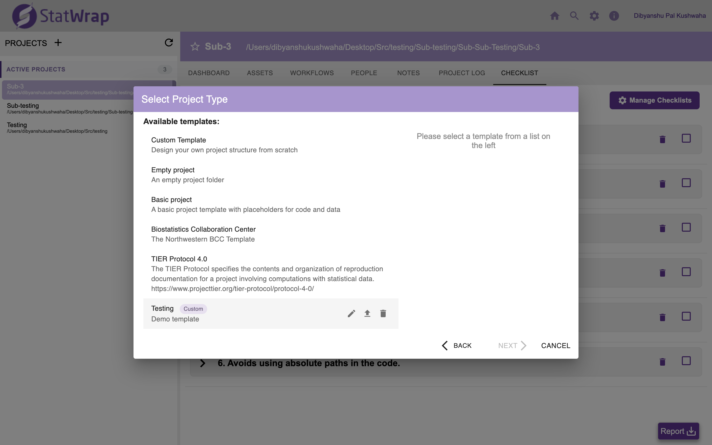
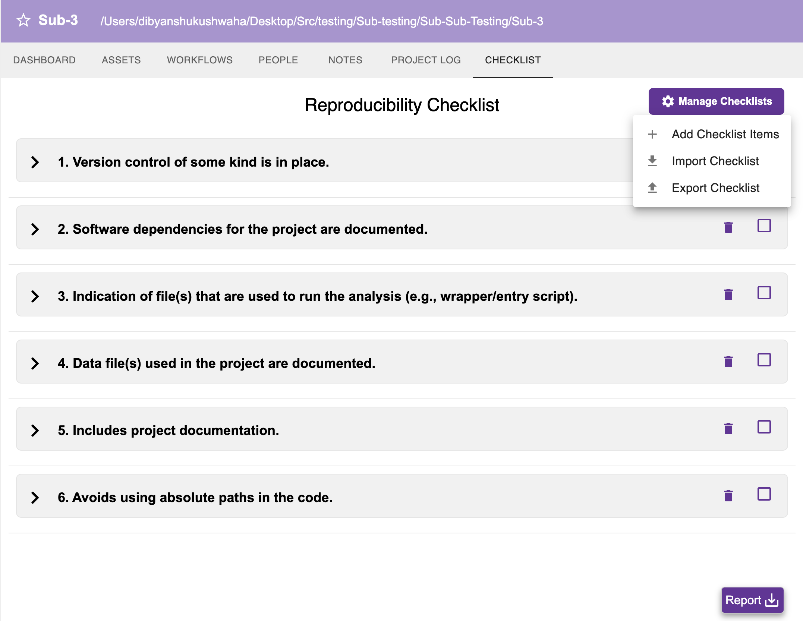
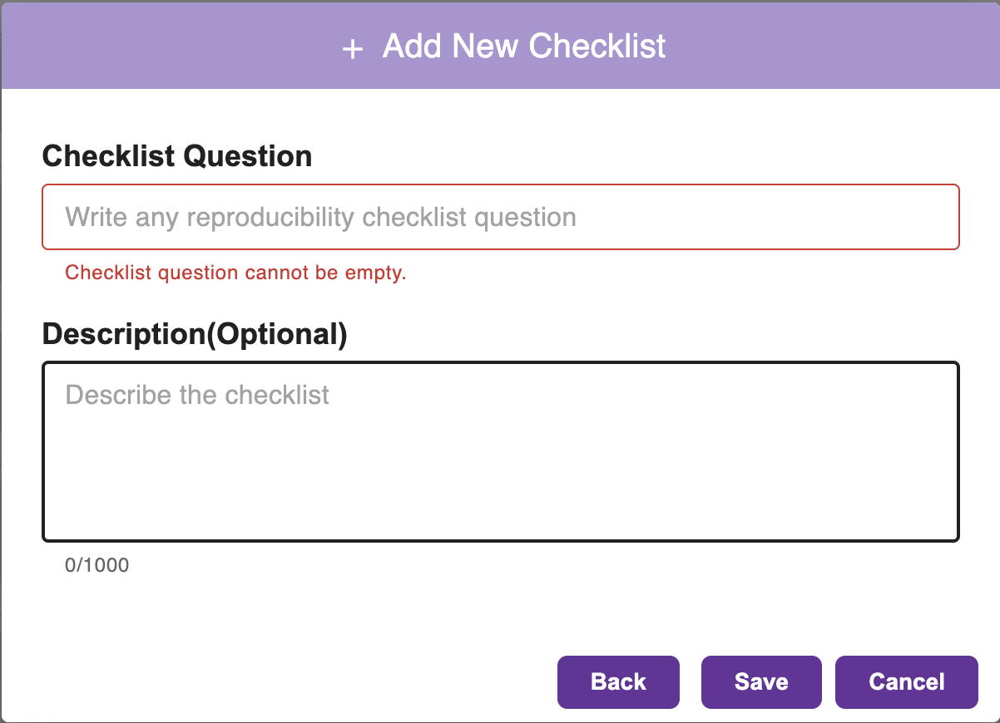
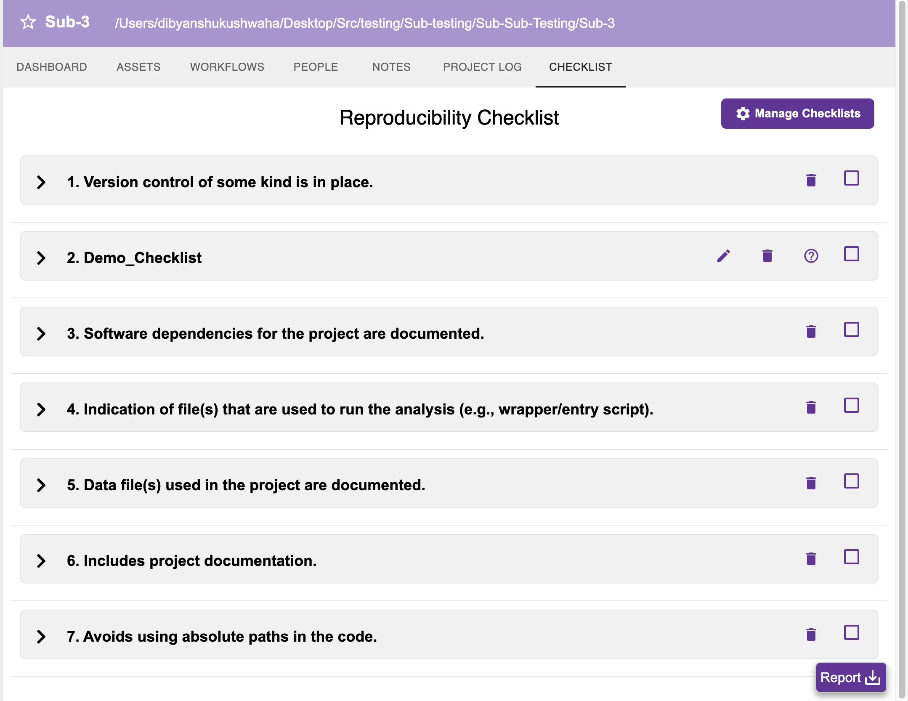
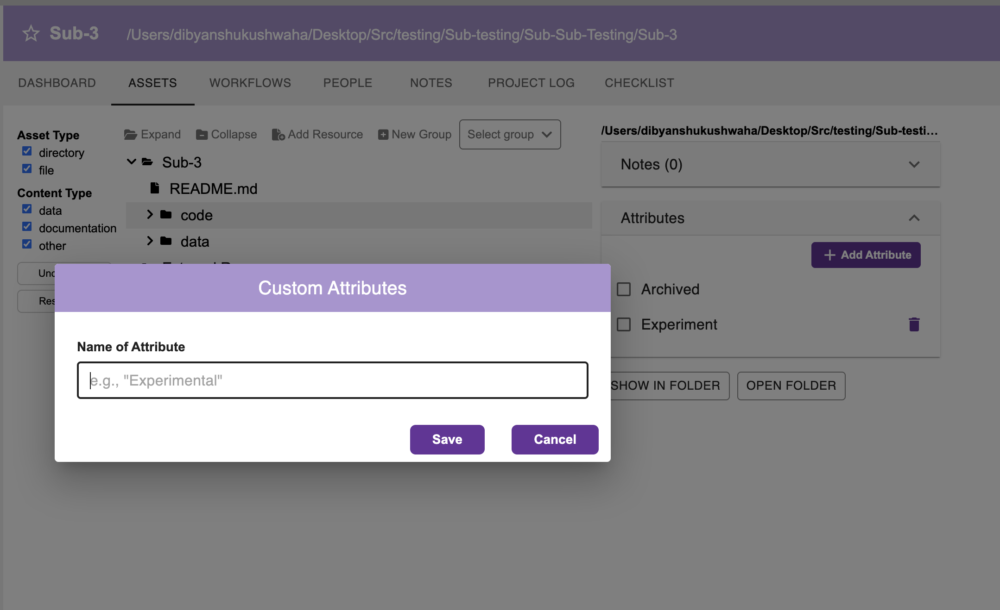

# **Introduction**

Hello everyone!   
I am Dibyanshu Pal Kushwaha, an undergraduate student studying Electrical Engineering at the National Institute of Technology Agartala, India. As part of the [StatWrap: Group and Individual Customizations](/project/osre26/northwestern/statwrap/) project, my [proposal](https://docs.google.com/document/d/17IxWc-m0opZdSriHxedDrdlh_M0gPVVBOz5l3enufQU/edit?usp=sharing), under the mentorship of {}, focuses on expanding StatWrap's capabilities to provide more flexibility to individual users and groups. Over the summer, I worked on making StatWrap's core features—project templates, reproducibility checklists, and asset attributes—fully customizable and shareable.

# **About the Project**

[StatWrap](https://sites.northwestern.edu/statwrap/) is a free and open-source assistive, non-invasive discovery and inventory tool used to document research projects. It helps investigators identify and track changes in a research project as it evolves, which is critical for reproducibility. 

Before this project, features like the directory template for creating new projects and the reproducibility checklist were static—meaning everyone who downloaded StatWrap had the exact same configuration. However, every researcher, team, and institution works differently. 

The goal of my project was to break away from this "one-size-fits-all" approach. I was tasked with building configuration schemes that allow users to create, modify, import, and export custom project templates and reproducibility checklists, as well as configure custom file-level attributes. All of this needed to be done securely, with robust error handling and seamless user interfaces.

# **Deliverables**

After an incredible summer of coding, testing, and refining, I am thrilled to share the completed deliverables for this project:

## **1. Custom Project Template Builder**

Researchers often have specific folder structures they use for every new project. I built a comprehensive Custom Template Builder to support this workflow.

* **Folder Upload & Filtering**: Users can upload an existing project folder to act as a seed for their new template. To ensure templates remain clean and lightweight, the system intelligently ignores irrelevant files (like `.csv`, `.png`, or `node_modules` folders etc) during the preparation phase.
* **Rigorous Security Checks**: Since templates can be shared, security is paramount. The import process includes strict security checks to prevent path traversal attacks, enforce size limits, and block potentially malicious file types. If an issue is detected, clear warnings are displayed to the user.
* **Manage Saved Templates (Edit/Export/Delete)**: Once a custom template is created, it appears alongside the default templates. Users can easily edit the template, export it as a `.zip` file to share with collaborators, or delete it (with a safety confirmation dialog to prevent accidental data loss).

## **2. Fully Customizable Reproducibility Checklists**

StatWrap provides a default reproducibility checklist, but institutions often have their own specific requirements. I completely overhauled the checklist system to make it dynamic.

* **Manage Checklists**: A new "Manage Checklists" dropdown allows users to Add, Import, or Export checklists as JSON files.
* **Checklist Addition**: When adding a new checklist item, the system checks for and prevents duplicates. Users can also add an optional description.
* **Interactive UI**: Custom checklist items appear with edit and delete buttons. The optional description is accessible via a neat `(?)` tooltip icon to keep the interface uncluttered.
* **Drag-and-Drop Reordering**: Priorities change. Users can seamlessly drag and drop checklist items to reorder them based on their specific needs.
* **Undo Functionality**: Accidental deletions happen. I implemented a snackbar with a time-limited "Undo" option, giving users a safety net when managing their lists.

## **3. Custom Asset Attributes**

To give users more granular control over tracking their files, I implemented Custom Attributes at the project level.

* **Binary Attributes**: Users can define their own custom tags (e.g., "Experimental", "Archived") to apply to project assets.
* **Duplicate Prevention**: The system validates inputs to ensure duplicate attributes cannot be created within the same project.

## **4. Robust Testing & Backward Compatibility**

A feature is only as good as its reliability. 
* **Jest Unit Testing**: I wrote rigorous unit tests using Jest for every new feature. This covers everything from the security filters on the ZIP imports to the drag-and-drop state management of the checklists.
* **Backward Compatibility**: Since StatWrap already has an existing user base, I ensured that all the new dynamic configuration schemes are fully backward-compatible with older, static project files.

# **Conclusion**

Building these customization features was a deeply rewarding challenge. It required balancing powerful flexibility with intuitive, uncluttered user interfaces. Features like the ZIP import pipeline demanded careful attention to security, while the drag-and-drop checklist required precise state management. Ultimately, these additions will allow researchers to spend less time fighting their tools and more time focusing on their science.

Working on StatWrap taught me invaluable lessons about React state management, secure file handling in JavaScript, and the importance of backward compatibility in production software.

A huge thank you to my mentors, Luke Rasmussen for his guidance, code reviews, and support throughout this journey!

