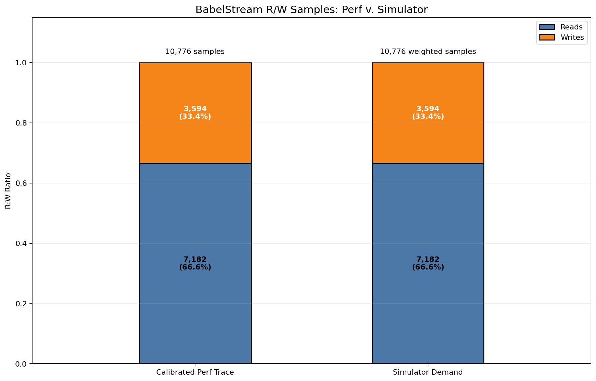
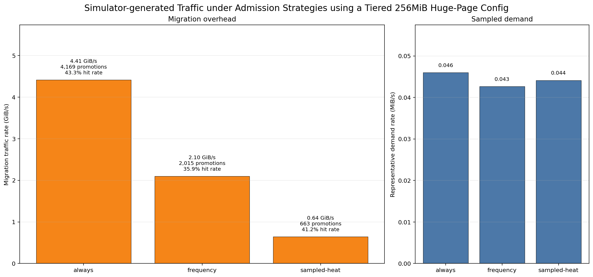

In high-performance computing systems, many important workloads such as LLM training and inference as well as scientific workloads are bottlenecked by the memory wall. Memory pooling and disaggregation to more efficiently share data is now more feasible since the introduce of Compute Express Link (CXL). However, hardware with CXL support is not readily available as only few datacenters have access to this. This introduces the need for architectual simulator tools, such as SimCXL, to model CXL at the trade-off of being prohibitively long to run to completion. Open-Source CXL Emulation at Hyperscale Architecture and Network (OCEAN) is an architectural simulator that uses QEMU-level emulation to simulate CXL rapidly. 

Under the mentorship of {}, during OSRE'26, I have made several key contributions to improve OCEAN's architecture and start a foundation for CXL memory tiering studies.

# Contributions

## Improvements to OCEAN's Infrastructure

While OCEAN works as a baseline tool and the research findings are documented in their (SC26 paper)[https://asplos.dev/pdf/OCEAN.pdf], the maintainability and reproducibility of OCEAN is something I wanted to do (especially to improve the open-source nature of the tool), and I accomplished this via the following:

### Reproducible Disk Images
To run OCEAN, you need to use a kernel image and a [rather large!] QEMU disk image. As an alternative to relying on tools like `gdown`, I wanted to have some way to reproduce the artifacts used to run an OCEAN-supported VM, which lead me to use (packer)[https://developer.hashicorp.com/packer/docs/intro] to allow this. This means, even if you don't have the golden disk and kernel images, you can still reproduce functionally equivalent ones.

### Added LMBench

Before my changes, one of the workloads that was not tested extensively was `lat_mem_rd` which is a part of the [LMBench](https://github.com/intel/lmbench) suite. The problem with the benchmarks in this repository is that they use vectorized memcpy functions, which is particularly problematic because the way OCEAN inspects memory requests to see if something was a load or store is by using KVM's MMIO to interpret the instruction. However, it is a [known issue](https://lists.nongnu.org/archive/html/qemu-discuss/2024-03/msg00012.html) that KVM's MMIO space does not support AVX or SSE instructions, such as `vmovdqu`, which is exactly what `lat_mem_rd` and similar benchmarks use. 

### Integrated QEMU/OCEAN Changes

Along the way, I improved OCEAN through several ways:

1. When a CXL device is trying to be found, the Label Storage Area (LSA) is a small region of memory which identifies/configures the device. In particular, the guest VM sends "mailbox" commands, which are control commands which can read the size of the LSA, read/write labels at specified offsets, and similar commands. I changed the width of the commands to use 2048 bytes instead of 64 bytes, which allows mailbox requests to be completed in 1 TCP roundtrip rather than multiple. I also implemented additional constraints to ensure the VMs and OCEAN agreed to use the same 256KiB (minimum, per the CXL spec) LSA file. 

2. I added a parameter CXL_CAPACITY_MB, which must be used with QEMU to specify the CXL memory capacity. This is particularly useful because the server would map unrelated guest pages to server-side cachelines using a % num_cachelines check, leading to an out-of-bounds access. The environment variable enforces the constraint that the capacities between the server and VMs cannot mismatch.

3. The CXLMemSim server tracked entries used a vector to scan for entries. Instead, I opted to use a hash-map so that accesses are constant rather than O(n). Additionally, I improved the performance of the shared memory manager by using `msync` to only flush modifies pages rather than the entire CXL region when you wrote to a specific address. 

4. CXLMemSim recently had changes to reduce the amount of [time PGAS polling took](https://github.com/SlugLab/CXLMemSim/commit/a9d46ecce92830455a666fb3b836fe67e6b2e245), increasing server performance. I incorporated this change into OCEAN's copy of CXLMemSim. 

### Improved CI/CD Tests

To achieve better reproducibility, I also integrated some CI/CD tests which incorporate several workloads and validate that they run to completion. In particular, the tests run single-VM (`lat_mem_rd` from LMBench) and multi-VM workloads ([OSU Allgather](https://github.com/forresti/osu-micro-benchmarks/blob/master/mpi/collective/osu_allgatherv.c) and [STREAM](https://www.cs.virginia.edu/stream/)

## Evaluation of Memory Tiering Strategies

Given OCEAN has improvements to its' infrastructure and can perform some CXL simulation, it should be ready for memory tiering, correct? Well, not quite, as the main problem with OCEAN is it's quite difficult to fully implement and understand the beenfits of tiering. When OCEAN sees a memory access, it converts them into MMIO transactions so accesses are seen by the window of CXL memory. However, these MMIO transactions can observe large amounts of overhead as accesses not only need to go through direct RAM, but also remote procedure calls (RPC) using TCP. 

Instead, to better test memory tiering at an early-stage I have spent some time trying to build an analytical model for memory tiering which uses different admission strategies (do we prioritize hot pages, N pages, pages close to each other, or always?) prefetching strategies (do we prefetch the next page/cacheline or not at all?) types of coherence (HDM-D and HDM-H), configurable caching granularities (64B, 2KB, 4MB), and three different tiering modes (baseline where there only exists DRAM, CXL pool only, and CXL with a DRAM "cache" in front of it). While this model is ulike [gem5](https://github.com/gem5/gem5) and won't be able to give you access-by-access metrics, it [tries] to serve as a reasonable first-order model to describe if certain tiering or placement strategies are actually worth using. 

To validate the behavior of my model, what I did is ran a real application the Triad kernel from [BabelStream](https://github.com/UoB-HPC/BabelStream), used the perf utility to capture data about the load and store activity (as well as approximating DRAM activity and how big operations were), took those traces, and then attempted to calibrate them by taking the R/W operations and trying to distribute activity across observed pages. Once I had the observed pages, I have my simulator replay the traces in the observed order, and how often a particular page is accessed (i.e., the "hotness") influences the likelihood they will be kept in our "cache" (in our "tiered" mode, the DRAM acts faster than the CXL pool-- hence we treat it like a "cache"). Our simulator doesn't use any actual traffic from DRAM, so the bandwidth measurements are not completely accurate and perf (or rather, for using the simulator: Intel's performance counters) can sample at a rate that is too-coarse grained we won't be able to capture *all* accesses. 

I tried to validate that we were seeing reasonable R/W behavior from our samples by taking our weighted traces from perf and that the behavior is being reflected in our simulator. The Triad kernel continuously performs the operation of `a[i] = b[i] + c[i] * SCALAR`. This transforms to 2 loads and 1 store, giving a 2:1 read to write (R:W) ratio. This is reflected in our graph, after running our trace through the simulator we can see roughly ~66% are reads and ~33% are writes, meaning our simulator correctly replays the traces based on our workload. 

Consider the following graph after running a set of experiments:

This graph shows the migration traffic for each admission policy I have ("baseline" means every missed page is promoted; "frequency" rejects many pages and reduces traffic as a result, but might keep less useful pages; "sampled-heat" is an admission policy which combines how frequently pages are accessed, if they are often hit, and how much of the page is being used to determine how "important" or "hot" the page is). The new policy, `sampled-head`, which uses "hotness" to keep pages actually has significantly lower traffic than the "always" policy, while keeping a high hit-rate!

While there are a lot of simplifying assumptions (such as using fixed latencies and not modeling contention in a lot of detail), some I think are reasonable and some of which need to be corrected. 

# What's next?

While I think there's still a long road ahead and I'll continue to work on thi evaluation, there are some next steps:

1. Refine the memory tiering and placement simulator-- particularly I need to test the behavior more thoroughly to see traces are behaving in a reasonable way.
2. Once the simulator shows [more] promising results and reasonable behavior, we should reimpelemnt key structures that are currently missing in OCEAN (e.g., OCEAN does not perform any sort of prefetching and doesn't really do page migration)
3. The model presented is somewhat unreasonable for larger-scale workloads such as LLMs. While I think it presents broad results, I think OCEAN/QEMU is more suitable for evaluating state-of-the-art HPC/ML workloads and performance impacts of tiering experiments in more detail.

This summer was a great learning experience, and I can't wait to continue working on improving CXL emulation and tooling! Please check out my work below!

OCEAN Changes: https://github.com/fam-emu/OCEAN/tree/ocean-cxl-gsoc
Tiering Simulator: https://github.com/poal023/cxl-tiering-sim
