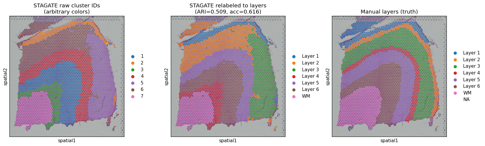

## Hello, world 👋

I'm **Jiawei Li**, a current graduate student at the University of Southern California working at the
intersection of machine learning and computational biology. I'm thrilled to be part of
the **Open Source Research Experience (OSRE'26)** this year, contributing to
[UC Santa Cruz OSPO](/project/osre26/ucsc/caust) under the mentorship of
**Lijinghua Zhang**. This post is a short introduction to me and to the project I'll be
building over the coming months.

## The project: CauST

As part of OSRE'26, my [proposal](https://summerofcode.withgoogle.com/media/user/af71a455291d/proposal/gAAAAABqM_mFg7Tevk5gpESIoYTWQJEwp7ino2Sk1bL27ndGikmQyZzxHMXUir1n4mz7qNhu3UZpMPdclfY6baYaL_wWfsTcesvczmVeH0MfaEGJKFz2TMc=.pdf)
introduces **CauST: Causal Gene Intervention for Robust Spatial Domain Identification**.

Spatial transcriptomics lets us measure gene expression while preserving the physical
location of each cell or spot within a tissue. A core task on this data is **spatial
domain identification** — partitioning the tissue into coherent regions (for example, the
cortical layers of the human brain) by combining what genes are expressed with where they
are expressed.

State-of-the-art methods, such as graph attention autoencoders, do this well on clean
data. But they remain vulnerable to **technical confounders** — batch effects, platform
differences, and noise — that can be correlated with biology and quietly distort the
domains a model recovers. When that happens, the "domains" reflect the experiment as much
as the tissue.

**CauST asks a causal question:** which genes *cause* a spot to belong to a given spatial
domain, as opposed to merely being *associated* with it through some confounder? By
framing domain identification as a problem of **causal gene intervention** — intervening
on gene expression and observing how domain assignments respond — CauST aims to learn
representations that are robust to these confounders and that generalize across tissue
sections, platforms, and batches.

## Why it matters

Robust, reproducible spatial domains are the foundation for downstream biology:
identifying disease-associated regions, mapping cell-type organization, and comparing
tissue across patients. If the domains shift when you change the scanner or the batch, so
does every conclusion built on top of them. Bringing causal reasoning into the pipeline is
a step toward results we can trust across labs and datasets.

## A first look

The figure below shows spatial domains recovered on a human dorsolateral prefrontal cortex
(DLPFC) section — the kind of benchmark CauST is designed to handle. The left panel is the
model's raw clustering, the middle panel aligns those clusters to the annotated cortical
layers, and the right panel is the expert "ground-truth" annotation. Getting that middle
panel to match the right one *robustly* — across every section, not just the easy ones —
is exactly the problem CauST sets out to solve.

## What's next

Over the OSRE'26 program I'll be:

- formalizing the causal model behind spatial domain identification,
- implementing the gene-intervention mechanism on top of a graph-based spatial encoder,
- and benchmarking robustness against existing methods across multiple tissue sections and
  platforms.

I'll be sharing progress, design decisions, and results here as the project develops.
Thanks for reading — and feel free to follow along!
