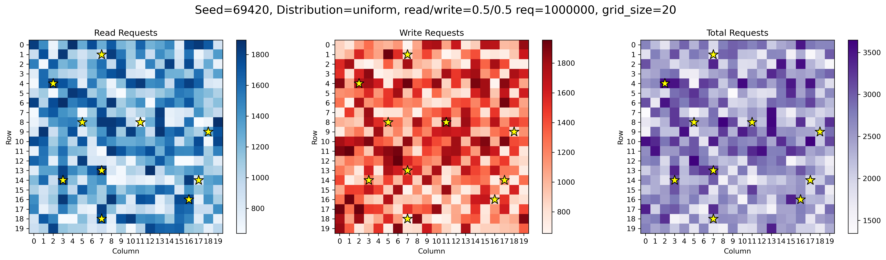
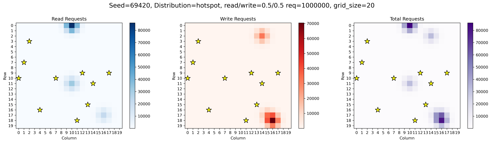
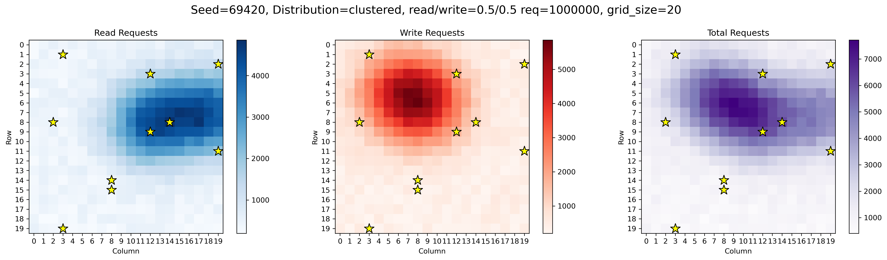
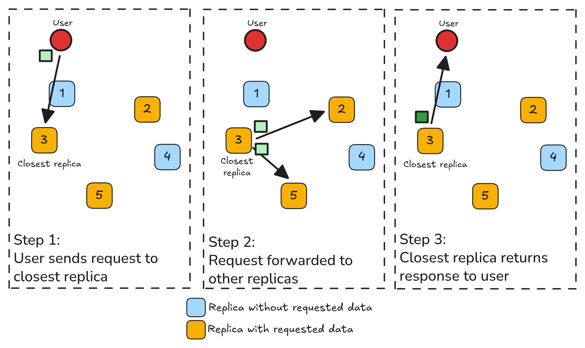
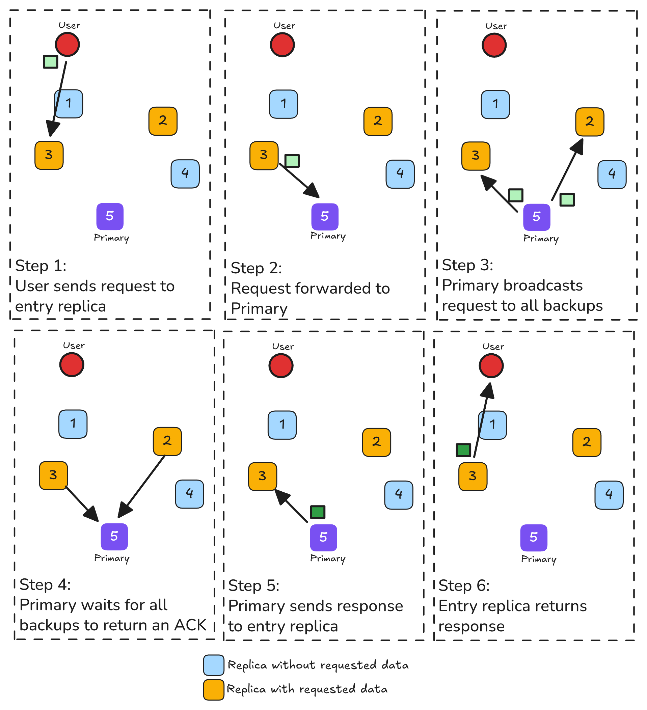

## Introduction

Hey there, I'm Michael. In this report, I'll be sharing my progress as part of the [Reconfigurable and Placement-Aware Replication for Edge Systems](/project/osre26/umass/edge-replication/) project under the mentorship of {}.

## About the Project

As described in my [introduction blog](/report/osre26/umass/edge-replication/20260609-mchan/), the goal of this project is to extend [Distrobench](https://distrobench.org/) with the ability to benchmark different placement algorithms under the same workload. Distrobench already lets me compare the throughput capacity and latency of consensus protocols, but it has no notion of *where* a node is, or whether moving a node closer to demand actually helps. This means implementing an abstraction layer that allows any arbitrary placement strategy to be evaluated against consensus protocols of all three types (Type 1: no placement feature at all, Type 2: placement feature but no strategy, Type 3: placement feature with its own built-in strategy), so I can eventually answer which placement algorithm performs best for a given workload, and at which consistency model.

The placement logic itself is grid-based. The deployment area is divided into an $n \times m$ grid of regions. Every node and client will be assigned to a region. The default placement strategy (a modification of [Epifâneo's consistency-aware node placement algorithm](https://ieeexplore.ieee.org/document/9685123/)) determines where nodes should sit by minimizing total end-to-end latency cost across all regions, weighted by how many requests each region sends:

$$\text{Minimize} \sum_{i \in I} \sum_{v \in V} \text{cost}(op^v, i) \cdot f_i(op^v)$$

| Symbol | Meaning |
|---|---|
| $i$ | Identifier for a region a request is sent from |
| $I$ | The set of all existing regions |
| $v$ | Identifier for the coordination type required for a request type |
| $V$ | The set of all coordination types |
| $op^v$ | Coordination type with the index $v$ |
| $cost(op^v, i)$ | The end-to-end latency cost of coordination type $v$ for a request sent from region $i$ |
| $f_i(op^v)$ | The number of requests sent from region $i$ with coordination type $v$ |

Because different consensus protocols use different consistency models, the cost function isn't the same for every request. It depends on the coordination pattern the consistency model requires, which can generally be categorized into:

- **Closest Round Trip** \
Reads and writes under eventual consistency, which can be served locally with no coordination.
- **Source Round Trip** \
Writes under primary-backup consistency, which must reach the primary and have state consolidated to backups before responding.
- **Majority Round Trip** \
Reads and writes under linearizable consistency, which need a quorum before responding.

Because each pattern has a different latency profile, a placement strategy that is consistency-aware could potentially yield better performance compared to a strategy that optimizes purely on geographic distance.

Before any of that abstraction layer can be built, Distrobench itself needed a reliable, reproducible way to generate a workload and to emulate node distance. The previous Python codebase contained too many hacks, which made it difficult to implement the placement strategy benchmark. The focus so far has been to fix this architectural mess and to add the grid-based placement logic.

## Progress

- **Migrating Distrobench to Golang** \
  The existing Distrobench codebase has been migrated to Golang. This gives the framework a single, consistent language to build the placement abstraction layer on top of, and makes it easier to interface with protocol implementations that expose Go-friendly APIs.

  The migration was also an opportunity to fix a structural issue in the old Python codebase. The CLI commands used to start, stop, and build each consensus protocol were hardcoded inside strings scattered throughout the code, which was brittle and made both modifying existing protocol support and adding new protocols painful. Under the new design, those CLI commands live in standalone bash scripts, while the Go code is only responsible for supplying the variables the scripts need and executing them, whether locally or on a remote node. This cleanly separates *what* commands need to run for a given protocol from *how* Distrobench orchestrates them.

- **Workload Generation via RNG Seeding** \
  Implemented a workload generator driven by an RNG seed, so that a given workload can be regenerated deterministically across different runs and different protocols. This is essential for the benchmark to be reproducible. The same seed should produce the same request distribution regardless of which consensus protocol or placement algorithm is under test.

  The deployment area is modeled as a $n \times m$ grid of cells, the same grid the placement cost formula operates over. The seed initializes a pseudorandom number generator (PRNG), which is used to derive a $\lambda_{i,j}$ value for every cell $(i, j)$ in the grid. Each cell's request count is then drawn as a Poisson sample using that cell's $\lambda_{i,j}$, giving a non-negative integer number of requests per cell. Because the whole process is seeded, the same seed always regenerates the exact same per-cell request distribution.

  The generator supports three distinct shapes for how that per-cell $\lambda_{i,j}$ is assigned across the grid, so the workload can represent different real-world demand patterns rather than just one. In each of the grids below, the stars denote cells where a node is placed.

  - **Uniform Distribution:** Every cell in the grid gets roughly the same share of requests, with a bit of seeded random noise added so the distribution still looks natural rather than perfectly flat.

    

  - **Hotspot Distribution:** A small number of cells are chosen as centers, and request volume is distributed outward from each center following a bell-curve (Gaussian) falloff. Cells closer to a center get more requests, cells farther away get fewer. This simulates demand being concentrated in a handful of high-traffic locations.

    

  - **Clustered Distribution:** Same as Hotspot Distribution, but with a much smaller variance, so instead of a few sharp peaks the requests spread out into a broader, cloud-like region rather than isolated hotspots.

    

  Read and write counts are generated separately. The total request count is first split into a read bucket and a write bucket according to the target read/write ratio, and then each bucket is distributed across the grid using whichever of the three shapes above was selected. Because both the random noise in Uniform and the Gaussian sampling in Hotspot/Clustered are probabilistic, the resulting per-cell counts don't necessarily sum to the exact total requested, so a final normalization pass rescales every cell proportionally to match the target total exactly.

- **Simulating Distance via Port-Level Latency Injection** \
  To emulate geographically distributed nodes without needing an actual multi-region deployment, latency is now injected at the port level so that communication between specific nodes can be made to resemble the delay of a real-world distance. This is effectively a stand-in for the $d_{ij}$ distance term in the placement cost formula. By controlling the latency between any two ports, I can approximate the effect of the $n \times m$ region grid and node/client geography in a controlled, local environment, without needing real multi-region infrastructure just to test the placement logic. This latency injection will directly affect the end-to-end coordination between nodes as well as client-to-node coordination time:

  - **Closest Round Trip** (e.g. eventual consistency) \
  The request is forwarded straight to the closest replica, which returns a response without waiting on a response from other replicas.

    

  - **Majority Round Trip** (e.g. linearizable consistency) \
  The request goes from the entry replica to the leader, the leader broadcasts to all replicas, waits for a quorum of acknowledgments, then broadcasts an execute command before the entry replica finally responds to the user.

    

  - **Source Round Trip** (e.g. primary-backup consistency) \
  The request goes from the entry replica to the leader (primary), which must coordinate with *every* replica in the cluster (not just a quorum) before the entry replica can respond.

    

  Because each pattern has a different number of hops and a different waiting condition, the same physical distance between two nodes costs very differently depending on which coordination type a given request triggers. This is the reasoning behind why a consistency-aware placement strategy could perform better.

## Challenges

Most of the difficulty so far has been in figuring out how to generate a workload that's actually representative of real usage, rather than one that's simple to implement but misleading to benchmark against:

- **Read/write ratios aren't just a random split** \
In many real deployments, most clients only issue reads while a small number issue writes. The naive approach is to randomize each client's operations according to a read/write ratio, but this breaks down for protocols that rely on client-centric cookies (e.g. session tokens used to track causal dependencies for a given client). Once a client's operations are tied to a cookie, you can't treat individual reads and writes as independent random draws. The ordering and grouping of operations per client actually matters to correctness, not just to load shape.

- **YCSB's closed-loop design doesn't capture protocol capacity well** \
[YCSB](https://github.com/brianfrankcooper/YCSB) is one of the most popular tools for this kind of workload generation, but it operates in a closed loop. Each client (thread) waits for a response before issuing its next request. This caps the achievable request rate at whatever the protocol's latency allows, which makes it hard to actually stress-test a protocol's true throughput capacity. The benchmark ends up measuring the system's service time rather than the client's wait time whenever there is a request queue.

  This distinction is explained well in [this blog](https://emptysqua.re/blog/ycsb-is-obsolete/), which argues that most real-world traffic is open-loop. New requests arrive on their own schedule, independent of whether earlier requests have finished, so a slow or overloaded system just accumulates a backlog instead of automatically getting a break. Closed-loop benchmarks like YCSB don't reflect that. They throttle themselves to match however fast the system responds, which is part of why the phenomenon has been called "coordinated omission". I needed the generator to keep sending requests at a fixed rate regardless of protocol latency, not slow down politely.

- **Simulating distance is easy for nodes, hard for clients** \
Injecting latency at the port level works well for nodes, since the set of nodes is small and fixed once a protocol is deployed. Each node/port pair just gets a latency value corresponding to its region in the grid. However, adding this latency value on the client's end is a different story. To properly evaluate a placement strategy, I need to simulate a large number of concurrent clients, each attached to a *different* region, all hitting the system at once. Assigning and maintaining a distinct simulated distance for potentially thousands of concurrent client connections rather than a small fixed set of node pairs is a much heavier problem than the node side. This is something I'm still working through.

## Future Goals
With a working workload generator and a way to simulate distance between nodes, the next steps are to actually build and evaluate a placement algorithm:

1. **Implement the placement algorithm abstraction layer**, so that Type 1, Type 2, and Type 3 protocols (as categorized in the introduction blog) can all be driven through a common interface regardless of how placement is (or isn't) supported natively.
2. **Implement a simple placement algorithm** as a first concrete strategy to run through that abstraction layer.
3. **Benchmark the simple placement algorithm against a protocol with a built-in placement algorithm**, to validate that the framework produces meaningful, comparable results between an externally-driven placement strategy and a protocol's native one.
