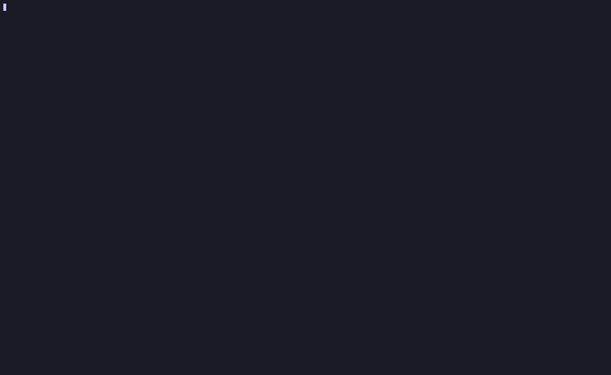

## Introduction

Hey there, I'm Michael. This is my final report for the [Reconfigurable and Placement-Aware Replication for Edge Systems](/project/osre26/umass/edge-replication/) project, under the mentorship of {}. In my [introduction blog](/report/osre26/umass/edge-replication/20260609-mchan/) I described the goal as extending [Distrobench](https://distrobench.org/) with the ability to benchmark placement algorithms. In my [mid-term blog](/report/osre26/umass/edge-replication/20260725-mchan/) I covered the migration of Distrobench to Go, a seeded workload generator, and a way to simulate distance between nodes without needing a real multi-region deployment. This report covers three new benchmarks built on top of that foundation, each with its own TUI screen, and an account on how the original plan changed along the way.

## A course correction from the mid-term plan

To start with, the mid-term blog described a Poisson-sampled $\lambda_{i,j}$ grid as the workload generation method. In the original plan, each cell's request count ($N_{i,j}$) comes straight out of a Poisson random number generator, seeded with that cell's own rate:

$$N_{i,j} = \text{poisson\_sample}(\lambda_{i,j})$$

The problem with using Poisson is that it conflicts with the `total request` user input that is later added to the TUI. The goal of the benchmark is for the user to set a total number of requests as a workload size for the placement algorithm. Using Poisson sampling doesn't guarantee the generated workload request count to be equal to `total request`.

The solution to this is to have the request distribution function (uniform, hotspot, clustered) generate a workload with any number of requests, then scale it to fit the number of requests.

Each of the three distributions actually builds its own rough grid a bit differently before that final scaling step:

- **Uniform** \
Every cell starts from the same flat base number, then gets its own random value picked somewhere between half of that base and one and a half times it. There's no separate shape here, just one flat number with randomness added directly on top.
- **Hotspot** \
A few center points get chosen, and traffic fades out the further a cell is from the nearest one. Most of the total goes into that shape. A smaller leftover portion of the total gets spread out separately, with its own independent randomness, added alongside the shaped part rather than multiplied into it.
- **Clustered** \
Same two-part idea as hotspot, a real shape for most of the traffic plus a separately-noised leftover portion. The difference from hotspot is only how tight the shape is, and how much of the total goes into the shape versus the leftover.

Whichever of the three builds that rough grid, the same final step always runs afterward:

- Add up the request count of every cell ($\text{raw}_{i,j}$) in the rough grid into `request count`
- Divide this `total request` from user input with the total `request count` across all cells
- Multiply every single cell by that multiplier

$$
N_{i,j} = \text{raw}_{i,j} \cdot \frac{ \text{total_request} }{ \text{request_count} }
$$

Since every cell gets scaled by the exact same number, adding them all back up will now guarantee the sum to be equal to `total request`.

One other change made from the Mid term blog is the addition of a full terminal UI for actually running benchmarks. Every earlier version was driven by editing config files and running scripts by hand. Everything from here on, picking instances, configuring a benchmark, watching it run, is now done through that TUI.

Here's the TUI preview:



## Add New Peer Benchmark

Initially, the plan for this benchmark is to be able to move data from one replica cluster to another (reconfiguration) and measuring how that move affects the client-side latency. The problem is that only a miniscule number of projects actually supports reconfiguration. So instead, I decided to change the benchmark into testing:

1. Can this consensus protocol implementation even add a new replica to a running cluster at all?
2. *(If No.1 is yes)* How long does it actually take to add the new replica?
3. *(If No.1 is yes)* What happens to client-facing latency while it's happening?

Not every implementation supports this at all. Some have no reconfiguration mechanism whatsoever. But at the very least, there's considerably more options compared to reconfiguration. Amongst the implementations that do support adding new peer, this benchmark reports two separate timing signals, not one:

- **Control-plane completion:** The moment the system's own coordination layer acknowledges the reconfiguration request.
- **Data-plane readiness:** The moment the new replica is actually caught up and serving real traffic.

There needs to be two timing signals to check for when a new replica has joined the cluster. This is because when calling a function to add a new peer, there is no *guarantee* that the new peer has caught up and is ready to handle request at the moment of the function return. 

These two variables will most likely report different timestamps. A protocol's control plane can report a command as accepted, or even fully processed, well before the new replica has actually finished catching up. Measuring only the first signal would understate how long a reconfiguration really takes from a client's point of view. The benchmark runs a closed-loop workload throughout, in either a single-client or multi-client shape, so the actual latency impact during the join is visible in the same result, not just the two timestamps.

## Latency + Geolocation Simulation Benchmark

The second new benchmark answers the question the mid-term blog left open:

> How does a protocol actually behave when replicas are geographically distributed, without needing a real multi-region deployment to test it?

This is done using Linux's out of the box `tc` command. `tc` can attach a rule to a machine's own network interface that holds every outgoing packet for a fixed extra amount of time before actually sending it, delaying that machine's own outbound traffic on purpose. The following is an example of how `tc` is used to inject latency:
```sh
$ ping -c 3 10.0.0.2
64 bytes from 10.0.0.2: icmp_seq=1 ttl=64 time=0.023 ms
64 bytes from 10.0.0.2: icmp_seq=2 ttl=64 time=0.051 ms
64 bytes from 10.0.0.2: icmp_seq=3 ttl=64 time=0.042 ms

# Add 50ms latency injection
$ tc qdisc add dev eth0 root netem delay 50ms

$ ping -c 3 10.0.0.2
64 bytes from 10.0.0.2: icmp_seq=1 ttl=64 time=50.1 ms
64 bytes from 10.0.0.2: icmp_seq=2 ttl=64 time=50.1 ms
64 bytes from 10.0.0.2: icmp_seq=3 ttl=64 time=50.0 ms
```

Distrobench uses this same mechanism between every pair of replicas being tested, one rule on each side of a pair so both directions are actually delayed, not just one. This only produces meaningful results on a real, remote deployment, where each machine genuinely has its own network address. On a single local machine, every node shares the same loopback address, and there's nothing for `tc` to actually distinguish between, so the benchmark is built to require a real deployment.

This latency with geolocation benchmark supports two client modes:

- **Single-client:** One client sends request to one replica in the cluster
- **Multi-client:** Every replica in the cluster has one thread that sends request to them

## Placement Algorithm Benchmark

Another benchmark added into Distrobench compares **placement algorithms** against each other, under the exact same generated workload. Two things get measured for each algorithm:

- How long does it take to calculate a placement?
- Against the generated workload, what is the expected total coordination cost of that placement?

To calculate the coordination cost, the following formula is used:

$$\text{Cost} = \sum_{i \in I} \sum_{v \in V} \text{cost}(op^v, i) \cdot f_i(op^v)$$

| Symbol | Meaning |
|---|---|
| $i$ | Identifier for a region a request is sent from |
| $I$ | The set of all existing regions |
| $v$ | Identifier for the coordination type required for a request type |
| $V$ | The set of all coordination types |
| $op^v$ | Coordination type with the index $v$ |
| $cost(op^v, i)$ | The end-to-end latency cost of coordination type $v$ for a request sent from region $i$ |
| $f_i(op^v)$ | The number of requests sent from region $i$ with coordination type $v$ |

The value of $\text{cost}(op^v, i)$ comes from real, physical distance, turned into a millisecond number. The whole grid stands in for a 5,000 km wide region. So the distance between two neighboring cells is:

$$\text{distance per cell} = \frac{5000 \text{ km}}{\text{gridSize}}$$

That distance gets turned into time using a fixed conversion rate, about 0.015 ms per km. This rate is picked so that a full 5,000 km trip lands around 75ms.

Every placement algorithm that is benchmarked will plug into one shared interface, whether it's one of Distrobench's own built-in ones or a real protocol's own placement logic. Basically:
- Given a workload, hand back which candidates to place
- Optionally, also name which one should lead

Cost is never computed by the algorithm itself. Distrobench provides a separate function to calculate the coordination cost from the output returned by every algorithm, so every result is evaluated the same way.

This directly answers the Type 1, 2, 3 protocol categorization from my introduction blog. A protocol with no placement logic of its own can still be tested using any of the built-in algorithms through this same interface. A protocol that already has its own logic can register that logic directly and get compared the same way. Neither case needs its own separate benchmarking path.

Currently, the framework ships two built-in algorithms, plus one carried over directly from a real implementation:
- **Centroid:** Find the cell in which the request distribution is centered on. Pick replicas closest from that point
- **Greedy Consistency Aware:** Find combination of replicas that minimizes the latency based on the coordination cost of the consistency model

No other real protocol implementation is wired in yet, but the interface itself doesn't require one to exist. Anything, built-in or eventually a real project's own code, plugs into the same registry and gets compared the same way.

## Challenges

- **A protocol's own "done" signal isn't always trustworthy** \
Different implementations report reconfiguration completion differently. There's no agreed upon way to report a successful replica joining a cluster, no guarantee that a command that has returned actually means the new replica has joined and is ready to serve. This is why control-plane completion and data-plane readiness signals are needed

- **Client-side distance never actually got solved, only sidestepped** \
Injecting latency between replicas turned out to be straightforward, each replica is its own real machine, so `tc` can target one specific machine's traffic at a time. Simulating distance from the client's side is a much harder problem. Physically, only one machine acts as the client, so making it look like many different clients calling in from many different simulated distances at once isn't something the same mechanism handles at all. This was already flagged as unsolved in my mid-term report, and it still is. For now, the Geolocation Simulation benchmark only ever injects delay between replicas, and deliberately leaves the client side alone rather than attempting a half solution.

## Conclusion

To be honest, I've set a target for this project that was overly ambitious when looking at how many separate moving parts ended up being involved. Trying to connect the different benchmarks together takes a lot more time than I initially expected. Building a reconfiguration timing benchmark, network-layer latency simulator, and placement algorithm comparison is quite challenging. Building them with a TUI to actually drive them makes it significantly more difficult, that I do not have time to actually glue different projects' implementation into the framework itself. I only managed to glue one implementation to Distrobench for the benchmarks.

I'm satisfied with where each piece landed individually, but I underestimated how much the "combine everything into one coherent framework" step would itself take, which is why that step is explicitly still ahead, not behind, me.

## Future To Do

1. **Combine the Placement Algorithm benchmark with the Geolocation latency simulator** \
Right now they exist as two separate benchmarks. The next step is to actually deploy a placement algorithm's chosen configuration and measure it under real, simulated geographic latency, rather than the two only ever being compared theoretically.
2. **Update the old web view** \
Distrobench has an existing web-based results view from a much earlier version of the project, which was never updated this summer since all available time went into the new benchmarks and the TUI. It needs to catch up to the current result formats.
3. **Glue together different projects' own implementations** \
The placement algorithm interface is built to support this, but nothing beyond the framework's own built-in algorithms is wired into it yet. Connecting the framework directly to a real project's own repository and code is still open.
